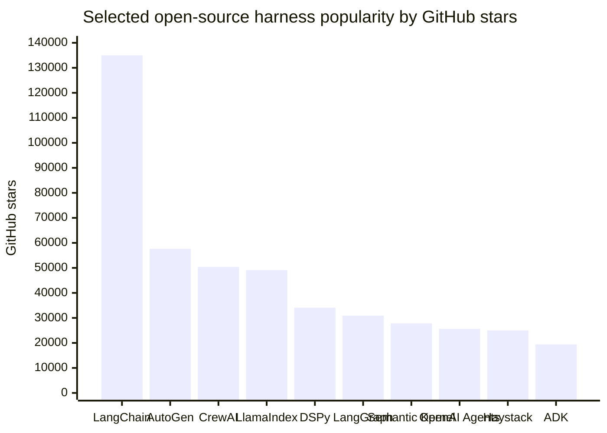
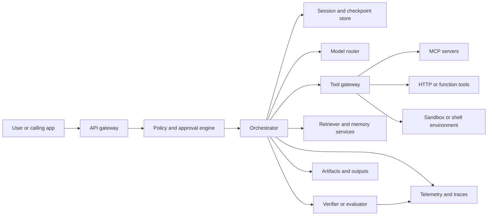
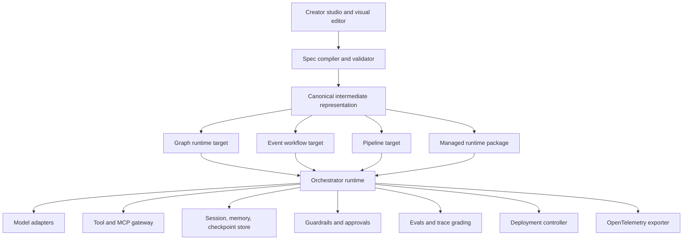

# AI Harnesses for Production Agent Systems

## Executive summary

An **AI harness** is best understood as the runtime and control layer that turns a model into a usable agent: it owns session and context management, tool and environment access, approvals, persistence, tracing, evaluation, and deployment. That definition is explicit in Microsoft’s description of agent harnesses, Anthropic’s Managed Agents documentation, AWS’s AgentCore harness documentation, and OpenAI’s Codex harness/App Server architecture. citeturn38view0turn33search2turn31search2turn37search1

For **open-source harnesses**, the strongest current choices are not interchangeable. **LangGraph** is the best general-purpose foundation when you need explicit state, resumability, and human-in-the-loop control; **OpenAI Agents SDK** is a compact, pragmatic default for tool-using agents with tracing and guardrails; **Microsoft Agent Framework** is a strong enterprise-grade choice for Python/.NET teams that want graph workflows, OpenTelemetry, and A2A/MCP interoperability; **Google ADK** is a strong code-first option for multi-agent systems and managed deployment into Google’s stack; **LlamaIndex** and **Haystack** are especially useful when retrieval, knowledge integration, and document/data pipelines dominate; and **DSPy** stands out when you can define a metric and want to optimize program quality rather than hand-tune prompts. By public GitHub popularity, the broad open-source leaders are LangChain, AutoGen, CrewAI, LlamaIndex, DSPy, and LangGraph. citeturn11view1turn7view0turn25view0turn7view1turn26search0turn28search16turn27search17turn9search2turn11view2turn5view3turn5view1turn5view2

There is **no honest single “highest-performing harness”** across all workloads. The clearest empirical findings point the other way: framework brand matters less than architecture, tooling, evaluation discipline, and model choice. Anthropic’s own guidance says teams usually do best with **simple, composable workflows** before escalating to elaborate agent architectures; Google’s agent-systems study found that **centralized multi-agent topologies help on parallelizable tasks**, **decentralized topologies help on dynamic navigation**, and **multi-agent variants can hurt sequential reasoning**, sometimes by 39–70%; meanwhile DSPy’s MIPRO work is one of the few primary-source results that attributes measurable gains to the harness/programming layer itself, reporting improvements of up to **13% accuracy** on five of seven multi-stage LM programs. citeturn21search0turn22search0turn22search3turn20search0

For a **new harness** and especially for a **harness-creator tool**, the strongest design direction is a **meta-harness**: a system that can compile the same high-level specification into stateful graphs, event-driven workflows, or managed runtime configs. The recurring primitives across the best systems are explicit state, typed tools, approvals, compaction, checkpointing, streaming events, OpenTelemetry traces, and first-class eval datasets. Managed products from OpenAI, Anthropic, AWS, Microsoft, and Google all converge on the same point: shell/filesystem/browser/code execution, long-running sessions, and observability are not optional extras; they are core harness responsibilities. citeturn24search0turn26search0turn28search1turn38view0turn16search10turn33search5turn31search2turn30search13turn14search12

## Definition and market segmentation

The market is easiest to understand if “harness” is treated as a **layer**, not a brand. In current primary sources, harnesses fall into three overlapping families.

The first family is the **open-source runtime harness**: frameworks such as LangGraph, AutoGen, LlamaIndex, Haystack, CrewAI, OpenAI Agents SDK, Microsoft Agent Framework, Google ADK, and DSPy. These frameworks give developers direct control over orchestration, tools, memory, validation, testing, and deployment targets. Their value is flexibility and portability; their downside is that teams must still design and operate policy, storage, observability, and production controls themselves. citeturn11view1turn11view2turn26search0turn28search16turn24search3turn7view0turn25view0turn7view1turn27search17

The second family is the **managed harness platform**: OpenAI’s Responses/Agent Builder/Codex surfaces, Anthropic’s Claude Managed Agents, Amazon Bedrock Agents with AgentCore Harness, Azure Foundry Agent Service, and Google’s Gemini Enterprise Agent Platform with Agent Engine. These systems reduce infrastructure work by packaging the agent loop, tool runtime, session state, managed environments, and observability into a hosted control plane. Their value is operating speed and production convenience; their downside is higher vendor coupling and less freedom to customize the deepest runtime semantics. citeturn16search15turn16search21turn37search1turn33search5turn31search2turn30search13turn17search17turn14search12

The third family is the **evaluation harness**. HELM provides broad, multi-metric, standardized model evaluation; EleutherAI’s `lm-evaluation-harness` remains the most established open-source benchmark harness for many few-shot model tasks; Ragas specializes in RAG evaluation; and modern runtime platforms increasingly ship native eval surfaces, including OpenAI Evals and trace grading, Azure Foundry evaluators, ADK golden datasets, Haystack evaluation, LlamaIndex evaluation, CrewAI testing, and DSPy’s `Evaluate`. For a new harness, this means evaluation should be a **first-class subsystem**, not a bolted-on dashboard. citeturn19search0turn19search1turn19search3turn16search1turn16search9turn17search0turn29search11turn28search2turn29search2turn29search5turn27search13



Selected stars above come from official GitHub repository pages captured in late April 2026; the Microsoft line is in transition, with **Microsoft Agent Framework** succeeding **Semantic Kernel**, so Microsoft’s ecosystem popularity is split across the legacy and successor repos. LangChain and LangGraph are also part of the same ecosystem, so their stars should not be double-counted as independent market share. citeturn9search2turn11view2turn5view3turn5view1turn5view2turn11view1turn5view0turn8view2turn11view0turn8view0turn12search3

## Comparative landscape

The comparison below is most useful if read as a **fit matrix**, not a leaderboard. Popularity is easiest to compare for open-source projects via GitHub stars; for closed platforms, public popularity is often only visible indirectly through ecosystem metrics, public download counts, or linked open-source repos.

| Name | Repo or vendor | Primary language | Core features | License or cost | Popularity metric | Benchmarked performance where available |
|---|---|---:|---|---|---|---|
| **LangChain** | `langchain-ai/langchain` | Python, JS/TS | High-level framework for agents and LLM apps; broad integrations; common entry point into LangGraph-backed execution citeturn9search2 | MIT citeturn9search2 | 135k★ GitHub citeturn9search2 | No neutral public framework benchmark surfaced in primary sources reviewed |
| **LangGraph** | `langchain-ai/langgraph` | Python, JS/TS | Low-level stateful graph orchestration, durable execution, checkpointing, HITL, streaming citeturn11view1turn24search0turn18search2 | MIT citeturn10view1 | 30.9k★ GitHub citeturn11view1 | LangChain’s modified τ-bench benchmark reported supervisor-architecture gains of about 50%; useful signal, but not a neutral cross-framework comparison citeturn22search1 |
| **AutoGen** | `microsoft/autogen` | Python, .NET | Multi-agent conversations, customizable interaction patterns, tools, code execution, GraphFlow-era orchestration citeturn20search1turn9search3turn10view2 | MIT code + CC-BY docs/signaling on repo page citeturn9search3 | 57.6k★ GitHub citeturn11view2 | Paper reports better results than single-LLM methods across pilot applications, but not a single standardized benchmark number citeturn20search1turn20search9 |
| **LlamaIndex** | `run-llama/llama_index` | Python | Data-centric/RAG framework, agents, agent workflows, event-driven workflows, OTel integration, deployment guides citeturn26search0turn26search1turn26search2turn26search3 | MIT citeturn4view1 | 49.1k★ GitHub citeturn5view1 | No neutral public framework benchmark surfaced in primary sources reviewed |
| **Haystack** | `deepset-ai/haystack` | Python | Modular components and pipelines, routers, agents, evaluation, tracing, explicit control over retrieval/memory/generation citeturn28search1turn28search0turn28search3turn28search2turn24search2 | Apache-2.0 citeturn11view0 | 25k★ GitHub citeturn11view0 | No neutral public framework benchmark surfaced in primary sources reviewed |
| **CrewAI** | `crewAIInc/crewAI` | Python | Multi-agent crews plus structured event-driven flows, guardrails, memory, knowledge, observability, commercial AMP extension citeturn24search3turn24search15turn24search7turn29search5 | Open-source framework; commercial AMP available citeturn18search3turn18search7 | 50.4k★ GitHub; README claims 100k+ certified developers citeturn5view3 | No neutral public framework benchmark surfaced in primary sources reviewed |
| **DSPy** | `stanfordnlp/dspy` | Python | Declarative LM programs, program optimization, assertions, evaluation, ReAct/RAG/agent modules citeturn27search17turn27search0turn27search2turn27search13turn27search3 | MIT citeturn4view2 | 34.1k★ GitHub citeturn5view2 | MIPRO paper reports up to **+13% accuracy** on five of seven multi-stage LM programs using Llama-3-8B citeturn20search0 |
| **OpenAI Agents SDK** | `openai/openai-agents-python` | Python, JS/TS | Agents, tools, handoffs, guardrails, human review, sessions, tracing, realtime agents, sandbox agents citeturn7view0turn16search2turn16search10 | MIT citeturn7view0 | 25.6k★ GitHub (Python SDK) citeturn8view2 | No standardized public framework benchmark cited in official docs reviewed |
| **Microsoft Agent Framework** | `microsoft/agent-framework` | Python, .NET | Graph-based workflows, checkpointing, time travel, OTel, middleware, A2A/MCP, multiple providers, hosting paths citeturn25view0turn12search2turn12search3 | MIT citeturn25view0 | 10k★ GitHub; successor to Semantic Kernel’s 27.8k★ legacy repo citeturn25view0turn5view0 | Microsoft’s migration guide claims better performance and memory behavior than the Semantic Kernel agent layer, but no neutral public benchmark was found citeturn12search1turn12search4 |
| **Google ADK** | `google/adk-python` | Python, plus Java/Go/TS ecosystem | Code-first, model/deployment-agnostic, tools, tool confirmation, multi-agent hierarchies, Cloud Run and Agent Engine deployment, evaluation workflows citeturn7view1turn13search1turn13search2turn29search11 | Apache-2.0 citeturn7view1 | 19.4k★ GitHub; Google says ADK exceeded 7M downloads citeturn8view0turn13search7 | No neutral public framework benchmark surfaced in primary sources reviewed |

| Name | Vendor | Primary language or surface | Core features | License or cost | Popularity metric | Benchmarked performance where available |
|---|---|---:|---|---|---|---|
| **OpenAI Responses API + Agent Builder + Codex harness** | OpenAI | API, Python, JS/TS | Recommended new primitive for agent-like apps; built-in tools; background mode; tracing; evals; hosted visual Agent Builder; Codex harness with bidirectional JSON-RPC App Server and cloud sandboxes citeturn16search15turn16search4turn16search0turn16search21turn37search1turn37search13 | Usage-based token + tool/container pricing citeturn16search3turn16search7 | Open-source ecosystem proxy: Agents SDK 25.6k★ citeturn8view2 | No neutral public framework benchmark cited in official docs reviewed |
| **Claude Managed Agents** | Anthropic | API, Python SDK | Fully managed autonomous-agent harness; sessions with persistent event history; secure file/command/web/code execution; prompt caching and compaction built in citeturn33search5turn33search2turn32search1turn32search3 | Tokens + session runtime; official docs show **$0.08 per session-hour** in `running` state citeturn36view0turn36view1 | Public adoption metric not disclosed in reviewed primary sources | No neutral public framework benchmark cited in official docs reviewed |
| **Amazon Bedrock Agents + AgentCore Harness** | AWS | API, CLI, managed runtime | Bedrock Agents for reasoning over APIs/data; AgentCore for secure scalable operation with runtime, memory, gateway, observability; harness config can stand up agents with minimal plumbing citeturn15search12turn15search0turn30search13turn30search10turn30search9turn31search2 | Usage-based: model charges plus AgentCore runtime/gateway/memory style charges citeturn15search1turn15search5 | Public product adoption metric not disclosed; ecosystem docs/tooling are active citeturn30search0turn30search2 | No neutral public framework benchmark cited in official docs reviewed |
| **Foundry Agent Service** | Microsoft Azure | API, SDKs, portal | Secure design/deploy/scale of agents; tracing to Azure Monitor/Application Insights via OTel; built-in evaluators; tools such as Code Interpreter and Bing grounding citeturn17search17turn17search3turn17search0turn17search14turn17search2 | Pay-as-you-go; tool-specific charges apply citeturn17search1turn17search10turn17search2 | Ecosystem proxy: MAF 10k★, Semantic Kernel legacy 27.8k★ citeturn25view0turn5view0 | No neutral public framework benchmark cited in official docs reviewed |
| **Gemini Enterprise Agent Platform** | Google Cloud | API, SDKs, managed runtime | Full-stack agent platform; ADK for build/orchestration; Agent Engine for managed serverless runtime; agent identity, governance, RAG/search integration, quotas and billing by product component citeturn14search12turn13search0turn13search1turn13search11turn14search13turn14search14 | Usage-based pricing by product/component citeturn14search5turn14search6turn14search14 | ADK proxy: 19.4k★ and 7M+ downloads citeturn8view0turn13search7 | No neutral public framework benchmark cited in official docs reviewed |
| **LangSmith Deployment** | LangChain | SaaS, cloud, hybrid/self-hosted enterprise tiers | Framework-agnostic deployment runtime for agents; observability/evals tightly integrated; long-running workflow deployment, auth, scaling, MCP exposure citeturn18search0turn18search1 | Requires Plus plan or above; seat + usage model on pricing page citeturn18search0turn18search1 | Ecosystem proxy: LangGraph 30.9k★ citeturn11view1 | No neutral public framework benchmark cited in official docs reviewed |
| **CrewAI AMP Suite** | CrewAI | SaaS / on-prem | Control plane, tracing/observability, analytics, security, cloud or on-prem deployment for CrewAI systems citeturn4view3turn18search3 | Sales-led / request demo; cloud or self-hosted factory options citeturn18search3 | Ecosystem proxy: CrewAI 50.4k★ and 100k+ certified developers claimed citeturn5view3 | No neutral public framework benchmark cited in official docs reviewed |

A useful practical takeaway from the table is that **runtime harnesses** and **evaluation harnesses** should be chosen separately. HELM is best when breadth, standardization, and public transparency matter; `lm-evaluation-harness` remains the most reusable open benchmark runner; Ragas is strong for retrieval-centric products; OpenAI, Foundry, ADK, Haystack, LlamaIndex, CrewAI, and DSPy all offer framework-native evaluation surfaces that should be integrated into any creator tool. citeturn19search0turn19search1turn19search3turn16search13turn17search0turn29search11turn28search2turn29search2turn29search5turn27search13

## Architectural patterns and tradeoffs

The strongest harnesses converge on a few architectural patterns.

**Stateful graph runtimes** are the best fit for long-running agents, resumability, and human intervention. LangGraph exposes durable execution with configurable durability modes (`exit`, `async`, `sync`), while Microsoft Agent Framework explicitly centers graph workflows with checkpointing, streaming, time travel, and OpenTelemetry. This pattern is the clearest answer when the problem includes interruptions, approvals, or recoverable multi-step work. The tradeoff is complexity: teams must reason about state schemas, checkpoints, and replay semantics rather than just prompt chains. citeturn24search0turn18search2turn25view0

**Event-driven workflow engines** are the next major pattern. LlamaIndex workflows are explicitly event-driven and async-first; CrewAI Flows are explicitly structured, event-driven workflows that can compose more autonomous crews; ADK similarly frames agent systems as modular, code-first workflows that can scale from simple tasks to hierarchies of specialist agents. This pattern is often the best middle ground between “a chain of calls” and “a free-form autonomous agent.” It tends to be easier to test than unrestricted agent loops and easier to parallelize than pure conversation-centric orchestration. citeturn26search0turn26search4turn24search15turn24search7turn7view1

**Pipeline and component architectures** are especially strong for retrieval-heavy systems. Haystack’s core design is components connected by pipelines, with routers, retrievers, generators, and tools as swappable units; this makes it unusually transparent for RAG, multimodal search, and hybrid deterministic-plus-agentic systems. If the main engineering challenge is retrieval quality, document routing, ranking, or explainable knowledge flow, pipeline-first harnesses are often more useful than agent-first harnesses. citeturn28search1turn28search0turn28search16turn28search3

**Declarative optimized programs** are the main differentiator of DSPy. DSPy’s wager is that prompt strings are the wrong abstraction, and that developers should instead express modular LM programs with metrics, optimizers, and assertions. When a high-quality evaluation set exists, this is the most evidence-backed route to squeezing accuracy gains out of the harness layer itself. The tradeoff is that DSPy is less of a turnkey operating harness than LangGraph, MAF, or managed platforms; it shines most when paired with strong evaluation discipline and explicit task metrics. citeturn27search17turn27search0turn27search2turn27search13turn20search0

**Managed harnesses** are increasingly a distinct category. Anthropic’s Managed Agents, AWS’s AgentCore harness, OpenAI’s Codex harness and App Server, and Microsoft’s agent-harness patterns all formalize the same boundary: the model “brain” should not be tightly entangled with tool execution, shells, filesystems, approvals, or session infrastructure. That layer should be explicit, inspectable, and policy-controlled. In practice, this is one of the most important design lessons for a new harness or creator tool. citeturn33search2turn31search2turn37search1turn38view0



This flow combines patterns that recur across OpenAI Agents/Responses, LangGraph, MAF, ADK, Haystack, Claude Managed Agents, and AgentCore: explicit policy checks, state reload/checkpoint, model planning, tool execution, retrieval, verification, and structured telemetry. citeturn16search6turn16search10turn24search0turn25view0turn7view1turn28search1turn33search2turn30search13

The most important **performance** lesson is not “use more agents.” Anthropic’s guidance argues for starting with simple composable workflows, and Google’s controlled scaling study reached a similar conclusion: task structure should determine topology. Centralized multi-agent coordination helped on highly parallelizable finance-style reasoning, decentralized patterns helped on dynamic browsing/navigation, and multi-agent systems degraded sequential reasoning tasks. In other words, harness design should make **single-agent, workflow, centralized multi-agent, and decentralized multi-agent** all available, but none should be the default everywhere. citeturn21search0turn22search0turn22search3turn22search7

The biggest **reliability** tradeoff is between latency and durability. Synchronous checkpointing, managed session history, background execution, and context compaction improve recoverability and long-run correctness, but they add storage writes, orchestration overhead, and operational cost. LangGraph documents this directly in its durability modes; Microsoft’s harness guidance emphasizes compaction for long histories; OpenAI’s background mode exists specifically for long-running tasks; Anthropic surfaces prompt caching and session runtime explicitly in pricing; and managed platforms from AWS and Google make runtime, memory, and observability first-class billing or product surfaces. citeturn18search2turn38view0turn16search0turn36view0turn30search13turn14search12

The largest **security** tradeoff is between capability and trust surface. Local shell tools, browser tools, code execution, MCP servers, and external search materially increase attack and compliance surface. Primary-source guidance is clear here: Microsoft recommends isolation and explicit approvals for local shell execution; OpenAI distinguishes hosted and local/private MCP and emphasizes approvals and guardrails; Azure documents that Bing grounding sends data outside Azure’s usual compliance boundary; Google emphasizes agent identity and audit trails; and AWS emphasizes secure gateways and observability around tool access. A new harness should therefore treat policy and approval as first-class middleware, not optional wrappers. citeturn38view0turn16search2turn16search8turn17search2turn14search12turn30search10

The largest **cost** tradeoff is between self-hosted flexibility and managed convenience. Open-source harnesses minimize licensing cost but push runtime, storage, and observability burden onto the team. Managed harnesses shift engineering effort into direct usage charges: OpenAI bills tokens plus tool/container costs; Anthropic bills tokens plus session runtime; Azure adds tool-specific charges such as Code Interpreter and Bing grounding; AWS bills Bedrock and AgentCore resources; Google charges by Agent Platform product components. Teams designing a creator tool should therefore model **cost per successful run**, not just token cost. citeturn16search7turn16search3turn36view0turn17search10turn17search2turn15search1turn15search5turn14search6turn14search14

## Reference architecture for a harness-creator tool

The right product architecture is **not** “yet another hardcoded agent loop.” It should be a **compiler and control plane** that accepts a high-level harness spec and emits one of several runtime forms: a graph runtime, an event-driven workflow, a pipeline DAG, or a managed-runtime bundle. That recommendation is grounded in the diversity of successful patterns: graphs in LangGraph and MAF, event-driven workflows in LlamaIndex/CrewAI/ADK, component pipelines in Haystack, and managed harnesses from OpenAI, Anthropic, and AWS. citeturn11view1turn25view0turn26search0turn24search15turn7view1turn28search1turn37search1turn33search2turn31search2



A practical module breakdown for the creator tool is shown below.

| Module | Responsibility |
|---|---|
| **Spec registry** | Store harness templates, versions, migration metadata, ownership, and environment overlays |
| **Compiler** | Validate template schemas, expand macros, infer runtime graph, and emit deployment bundles |
| **IR model** | Canonical representation of agents, steps, events, tools, policies, memory, and eval hooks |
| **Runtime orchestrator** | Execute runs, stream events, checkpoint state, and resume after interruption |
| **Model adapter layer** | Normalize vendor/model calls, structured output, retries, routing, token accounting |
| **Tool gateway** | Execute local tools, hosted tools, HTTP functions, and MCP servers behind one typed contract |
| **Policy engine** | Apply approvals, allowlists, PII filtering, side-effect classification, output validation |
| **Session and checkpoint store** | Persist short-term state, resumable step state, working memory, branch histories |
| **Artifact store** | Persist files, screenshots, patches, reports, execution summaries, evaluation artifacts |
| **Telemetry and eval service** | Emit traces, metrics, logs, datasets, graders, replayable run histories |
| **Deployment controller** | Package and deploy the same harness to local dev, self-hosted, or managed cloud targets |

A strong default IR should be **typed, event-capable, and runtime-agnostic**. One viable schema is:

```json
{
  "template_id": "support-agent-v1",
  "mode": "graph",
  "agents": [
    {
      "id": "triage",
      "role": "root",
      "model_policy": "balanced-default",
      "instructions_ref": "prompt://support/triage",
      "allowed_tools": ["kb_search", "crm_lookup", "ticket_update"],
      "memory_policy": "thread-plus-user",
      "handoff_targets": ["billing", "technical"]
    }
  ],
  "tools": [
    {
      "id": "kb_search",
      "type": "mcp",
      "schema": "tool://kb/search",
      "approval_mode": "none",
      "timeout_ms": 4000
    },
    {
      "id": "ticket_update",
      "type": "http",
      "schema": "tool://ticket/update",
      "approval_mode": "required",
      "side_effect_level": "high"
    }
  ],
  "workflow": {
    "nodes": ["ingress", "retrieve", "plan", "act", "verify", "respond"],
    "edges": [
      ["ingress", "retrieve"],
      ["retrieve", "plan"],
      ["plan", "act"],
      ["act", "verify"],
      ["verify", "respond"]
    ],
    "checkpoint_policy": "async"
  },
  "context_policy": {
    "max_context_tokens": 120000,
    "compaction_strategy": "summary-plus-artifacts",
    "artifact_refs": true
  },
  "eval_suite": {
    "dataset_id": "support-golden-v3",
    "graders": ["resolution_correctness", "policy_compliance", "tone"],
    "blocking_thresholds": {
      "resolution_correctness": 0.92,
      "policy_compliance": 0.99
    }
  },
  "deployment": {
    "target": "managed-or-selfhosted",
    "streaming": true,
    "otel_enabled": true
  }
}
```

That schema should compile into typed runtime contracts. A minimal interface set could look like this:

```python
class ModelAdapter(Protocol):
    async def generate(self, messages, tools, response_schema, session) -> "ModelStep": ...

class ToolAdapter(Protocol):
    async def invoke(self, tool_name, arguments, run_ctx) -> "ToolResult": ...

class PolicyEngine(Protocol):
    async def pre_tool(self, proposed_call, run_ctx) -> "ApprovalDecision": ...
    async def post_output(self, output, run_ctx) -> "ValidationResult": ...

class StateStore(Protocol):
    async def load(self, session_id) -> "SessionState": ...
    async def checkpoint(self, session_id, state, step_event) -> None: ...

class Evaluator(Protocol):
    async def run_suite(self, run_id, dataset_id) -> "EvalReport": ...

class DeploymentTarget(Protocol):
    async def deploy(self, compiled_bundle, env) -> "DeploymentInfo": ...
```

A creator tool should also expose a **client-friendly streaming API**, not just REST polling. OpenAI’s Codex App Server is a strong reference point here because it exposes the harness through a stable, bidirectional JSON-RPC surface that maps client requests into thread-managed core sessions and returns rich event updates for UI construction. That is a better model for a creator tool than a single `POST /run` endpoint with an opaque final answer. citeturn37search1

A concise HTTP surface could still complement streaming:

```http
POST   /v1/templates
GET    /v1/templates/{id}
POST   /v1/templates/{id}:compile
POST   /v1/runs
GET    /v1/runs/{id}
GET    /v1/runs/{id}/events
POST   /v1/runs/{id}/approvals
POST   /v1/evals/runs
GET    /v1/evals/runs/{id}
POST   /v1/deployments
POST   /v1/tools/mcp/register
POST   /v1/tools/http/register
```

The most important design choice is to make **specs explicit and small**. OpenAI’s harness-engineering guidance argues against giant monolithic instruction files and toward concise navigational context with structured docs close to code; Anthropic’s long-running harness guidance and Microsoft’s compaction guidance both point the same way. A creator tool should therefore generate a short root instruction file plus typed linked artifacts, rather than a single giant prompt blob. citeturn37search0turn32search3turn38view0

## Implementation blueprint

At implementation time, the most important internal choice is to separate **append-only event history** from **materialized session state**. The event log is what you replay, audit, evaluate, and stream to the UI. The materialized state is what you use for fast resumption. This aligns with how modern harnesses expose sessions, traces, and checkpoints. OpenAI’s tracing and session model, Anthropic’s persistent event history, LangGraph’s checkpoints, MAF’s checkpoint/time-travel model, and AgentCore observability all point toward this split. citeturn16search10turn7view0turn33search5turn24search0turn25view0turn30search9

For **logging and telemetry**, OpenTelemetry should be the default wire format. It is vendor-neutral, widely adopted, and already supported directly or indirectly by many leading harness stacks: OpenAI Agents, MAF, Foundry, Haystack, LlamaIndex, and AgentCore all expose or integrate with OTel-style tracing. A creator tool should therefore emit spans for at least `run`, `step`, `model_call`, `retrieval`, `tool_call`, `approval`, `checkpoint`, `compaction`, `evaluator`, and `deployment`. It should also attach standardized dimensions such as `session_id`, `template_id`, `agent_id`, `tool_name`, `tenant_id`, `cost_usd_estimate`, `token_in`, `token_out`, `latency_ms`, `error_class`, and `policy_decision`. citeturn26search6turn16search10turn25view0turn17search3turn24search2turn26search2turn30search9

For **testing and evaluation**, the right strategy is layered.

| Test layer | What it should prove | Practical implementation |
|---|---|---|
| **Unit tests** | Pure logic is correct | Schema validation, graph compilation, policy branching, pricing estimation |
| **Contract tests** | Adapters honor tool and model schemas | MCP contracts, function-call JSON schema, auth and retry behavior |
| **Replay tests** | Runtime changes do not break known runs | Deterministic replays over recorded traces and tool fixtures |
| **Golden dataset tests** | Business outcomes stay acceptable | Route fixed datasets through agents and compare graders/metrics |
| **Trace grading** | Trajectory quality, not just final answer | Grade tool choices, handoffs, approvals, safety checks, compaction quality |
| **Load and soak tests** | Scaling and durability are safe | Concurrent sessions, long-lived runs, resume-after-failure, storage pressure |
| **Security tests** | Safety controls actually work | Prompt injection, tool escape attempts, policy bypass, PII exfiltration, sandbox abuse |
| **Canary tests** | New runtime version is safe in production | Shadow traffic, subset routing, rollback on eval or latency regressions |

This test stack is strongly supported by the landscape: OpenAI emphasizes datasets, trace grading, and Evals API; Foundry has built-in agent evaluators and tracing; ADK explicitly teaches golden datasets for regression detection; Haystack, LlamaIndex, CrewAI, and DSPy all expose evaluation or testing surfaces. citeturn16search1turn16search9turn16search13turn17search0turn17search3turn29search11turn28search2turn29search2turn29search5turn27search13

For **CI/CD**, a strong default pipeline is: schema linting and typecheck, tool-contract validation, deterministic replay suite, offline eval suite, dependency/vulnerability scan, performance smoke test, then deployment to a canary environment with live tracing gates. DSPy’s insistence on metric clarity, OpenAI’s trace-based evaluation surfaces, and the platform-native observability stacks all argue that releases should be blocked on **measured quality**, not only code correctness. citeturn27search5turn16search13turn17search0turn30search9

For **deployment**, the creator tool should support three profiles because the user did not specify platform, budget, or SLA goals. A **local/self-hosted profile** should target containers and Kubernetes for teams that want data locality and custom infrastructure. A **managed-cloud profile** should target Agent Engine, Foundry, OpenAI-hosted surfaces, Claude Managed Agents, or AgentCore for fast productionization. A **hybrid profile** should keep the control plane centralized while letting tool/data execution live inside the customer VPC or private environment. That matches the market’s actual operating modes. citeturn13search2turn14search12turn17search17turn33search5turn31search2turn30search13turn18search0turn18search3

The recommended **default design pattern** for new harnesses is therefore:

A **single-agent or tightly bounded workflow baseline**, explicit state and checkpoints, typed tools behind a policy gateway, a short and structured instruction surface, eval-backed iteration, and upgrade paths into centralized multi-agent topologies only when task decomposition is demonstrably helpful. That is the pattern most consistent with Anthropic’s guidance, Google’s scaling results, and the architecture choices of the best current frameworks. citeturn21search0turn22search0turn22search3turn24search0turn25view0turn7view1

## Open questions and limitations

The main limitation in this landscape is **benchmark comparability**. Most public “framework benchmarks” are really architecture or model benchmarks, and often they are vendor-authored. The strongest fairness comes from benchmark harnesses like HELM and `lm-evaluation-harness`, but those mostly evaluate models and prompting/task setups, not the full operational harness layer. As a result, any claim that one runtime harness is universally best-performing should be treated skeptically. citeturn19search0turn19search1turn22search1turn22search0

A second limitation is that **commercial popularity data is sparse**. Open-source stars are visible; enterprise adoption counts usually are not. In this report, commercial popularity metrics were therefore treated as ecosystem proxies where necessary, using linked open-source repos or official vendor usage signals such as ADK downloads and CrewAI’s certified-developer claim. citeturn13search7turn5view3

A third limitation is that **this market is still moving quickly**. MCP is under active development, A2A is still young, Microsoft is in the middle of the Semantic Kernel to Agent Framework transition, and the meaning of “harness” itself is becoming more explicit only recently in AWS, Microsoft, Anthropic, and OpenAI materials. A new harness-creator tool should therefore be built around **adapters, typed IRs, and protocol abstraction**, not assumptions that today’s provider surfaces will remain stable. citeturn23search0turn23search4turn12search3turn31search2turn38view0turn33search2turn37search1