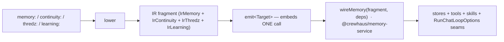
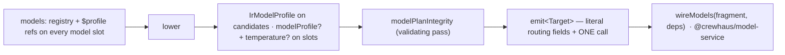

# Compiler architecture

Crewhaus is a **meta-harness compiler**. A single high-level YAML spec compiles into one of many target shapes — a CLI agent, a channel bot, a stateful graph, a RAG pipeline, a multi-agent crew, an on-chain daemon, and more; the canonical IR-variant table below maps every target to its IR variant and emitter. The intent is not "yet another agent loop." It is a typed compiler whose IR is the *only* thing that holds the agent's semantics, and whose backends are swappable codegen functions over that IR.

This doc walks the compiler with file paths so contributors can navigate from a YAML key all the way to the line that emits the corresponding TypeScript.

## The pipeline at a glance

```mermaid
flowchart LR
    YAML[crewhaus.yaml] --> P[parseSpec]
    P --> S[Spec discriminated union]
    S --> L[lower]
    L --> IR[IrNode discriminated union]
    IR --> AP[applyPasses]
    AP --> IR2[IrNode optimised]
    IR2 --> E[emit]
    E --> B[Bundle: file[]]
    B --> W[writeFileSync]
    W --> AGENT[dist/agent.ts + package.json + ...]
```

Each stage corresponds to a function with a stable signature; nothing in the pipeline reaches around it.

| Stage | Function | File |
|---|---|---|
| Parse + Zod-validate YAML → typed `Spec` | `parseSpec(yaml: string)` | [packages/spec/src/index.ts](https://github.com/crewhaus/factory/blob/main/packages/spec/src/index.ts) |
| Lower `Spec` → `IrNode` (the variant matching `spec.target`) | `lower(spec)` | [packages/compiler/src/index.ts](https://github.com/crewhaus/factory/blob/main/packages/compiler/src/index.ts) (`export function lower`) |
| Apply IR-level optimisation passes | `applyPasses(ir)` | [packages/ir-passes/src/index.ts](https://github.com/crewhaus/factory/blob/main/packages/ir-passes/src/index.ts) (`export function applyPasses`) |
| Dispatch to target emitter | `emit(ir, opts)` | [packages/compiler/src/index.ts](https://github.com/crewhaus/factory/blob/main/packages/compiler/src/index.ts) (`function emit`) |
| Top-level convenience | `compile(yamlText, opts): CompileResult` | [packages/compiler/src/index.ts](https://github.com/crewhaus/factory/blob/main/packages/compiler/src/index.ts) (`export function compile`) |
| CLI entry point | `runCompile(args)` | [apps/cli/src/index.ts](https://github.com/crewhaus/factory/blob/main/apps/cli/src/index.ts) |

The CLI does not branch on `spec.target`. The discriminator lives in the YAML and is honoured polymorphically by `lower()` and `emit()`. Adding a new target therefore never touches the CLI.

Two 0.4.0 refinements to this pipeline are covered in their own sections below: `compile()` now returns a `CompileResult` (a `Bundle` plus an additive `warnings` array — see [The `compile()` warnings framework](#the-compile-warnings-framework)), and the *validating* subset of the ir-passes now runs **unconditionally** between `lower()` and `emit()` rather than only under `applyIrPasses: true` (see [Validating passes run unconditionally](#validating-passes-run-unconditionally-v040)).

## The IR is a discriminated union

```ts
// packages/ir/src/index.ts — `export type IrNode`
export type IrNode =
  | IrV0          // CLI agent
  | IrWorkflowV0  // Sequential workflow
  | IrChannelV0   // Channel bot daemon
  | IrGraphV0     // Stateful graph runtime
  | IrManagedV0   // Multi-tenant managed daemon
  | IrPipelineV0  // RAG / pipeline
  | IrCrewV0      // Multi-agent crew
  | IrResearchV0  // Autonomous research bundle
  | IrBatchV0     // Queue-driven batch worker
  | IrVoiceV0     // Voice / realtime agent
  | IrBrowserV0   // Computer-use / browser-driving agent
  | IrEvalV0      // Eval bundle (bootable artefact)
  | IrChainV0     // On-chain event/block/address daemon
  | IrChainGameV0; // On-chain game-playing agent (perceive-act loop)
```

Each variant is a separate Zod-validated type with a `target` discriminator. Variants only carry the fields they need: `IrPipelineV0` has `indexing` and `retrieve` blocks but no `tools` array; `IrGraphV0` has `nodes` and `edges` but no `agent`; `IrVoiceV0` has `vad` and `barge_in` settings that no other variant needs. There is no shared mega-shape that targets cherry-pick from.

This is the meta-harness thesis incarnate: **the IR variant *is* the target's contract**. Anything not on the variant cannot be expressed in that target shape.

**0.4.0 added no new variant** — the union is still the fourteen above. What the Loop-contract-0.4 batches did instead was *enrich existing variants with new optional fields*: `limits?: IrLimits`, `hooks?: readonly IrHook[]`, `agent.thinking?: IrThinking`, `agent.streaming?`, `agent.rateLimits?: IrRateLimits`, `evaluation?: IrEvaluation`, `knowledge?: IrKnowledge`, `expose?: IrExpose`, `plugins?`, and `schedule?: IrSchedule`, plus graph-only `when` / `parallel` / `messageSchemas`. Every one is optional and absent-by-default, so a spec that doesn't declare the corresponding key lowers byte-identically to pre-0.4.0. The [Loop-contract-0.4 field lowering](#loop-contract-04-field-lowering-v040) section below walks each field from its spec key to its IR home.

## IR variant ↔ lowering ↔ emit ↔ section ↔ recipe ↔ example

This is the canonical mapping. Use this table when you need to navigate from a YAML target to its implementation, or vice versa.

| `target` | IR variant | `lower` case | `emit<Target>` | Target package | Build-roadmap | Recipe | Example |
|---|---|---|---|---|---|---|---|
| `cli` | `IrV0` | [compiler L246](https://github.com/crewhaus/factory/blob/main/packages/compiler/src/index.ts) | `emitCli` | [packages/target-cli](https://github.com/crewhaus/factory/tree/main/packages/target-cli) | §1–§5 | [01](https://github.com/crewhaus/demos/blob/main/walkthroughs/01-cli-coding-agent.md) | [starters/cli](https://github.com/crewhaus/demos/tree/main/starters/cli) |
| `workflow` | `IrWorkflowV0` | [compiler L263](https://github.com/crewhaus/factory/blob/main/packages/compiler/src/index.ts) | `emitWorkflow` | [packages/target-workflow](https://github.com/crewhaus/factory/tree/main/packages/target-workflow) | §6 | [02](https://github.com/crewhaus/demos/blob/main/walkthroughs/02-sequential-workflow.md) | [starters/workflow](https://github.com/crewhaus/demos/tree/main/starters/workflow) |
| `channel` | `IrChannelV0` | [compiler L279](https://github.com/crewhaus/factory/blob/main/packages/compiler/src/index.ts) | `emitChannelBot` | [packages/target-channel-bot](https://github.com/crewhaus/factory/tree/main/packages/target-channel-bot) | §12 | [03](https://github.com/crewhaus/demos/blob/main/walkthroughs/03-slack-bot.md) | [starters/channel](https://github.com/crewhaus/demos/tree/main/starters/channel) |
| `graph` | `IrGraphV0` | [compiler L297](https://github.com/crewhaus/factory/blob/main/packages/compiler/src/index.ts) | `emitGraph` | [packages/target-graph](https://github.com/crewhaus/factory/tree/main/packages/target-graph) | §19 | [05](https://github.com/crewhaus/demos/blob/main/walkthroughs/05-stateful-graph.md) | [starters/graph](https://github.com/crewhaus/demos/tree/main/starters/graph) |
| `managed` | `IrManagedV0` | [compiler L317](https://github.com/crewhaus/factory/blob/main/packages/compiler/src/index.ts) | `emitManaged` | [packages/target-managed](https://github.com/crewhaus/factory/tree/main/packages/target-managed) | §20 | [11](https://github.com/crewhaus/demos/blob/main/walkthroughs/11-managed-multitenant.md) | [starters/managed](https://github.com/crewhaus/demos/tree/main/starters/managed) |
| `pipeline` | `IrPipelineV0` | [compiler L333](https://github.com/crewhaus/factory/blob/main/packages/compiler/src/index.ts) | `emitPipeline` | [packages/target-pipeline](https://github.com/crewhaus/factory/tree/main/packages/target-pipeline) | §21 | [06](https://github.com/crewhaus/demos/blob/main/walkthroughs/06-rag-pipeline.md) | [starters/rag](https://github.com/crewhaus/demos/tree/main/starters/rag) |
| `crew` | `IrCrewV0` | [compiler L357](https://github.com/crewhaus/factory/blob/main/packages/compiler/src/index.ts) | `emitCrew` | [packages/target-crew](https://github.com/crewhaus/factory/tree/main/packages/target-crew) | §22 | [04](https://github.com/crewhaus/demos/blob/main/walkthroughs/04-multi-agent-crew.md) | [starters/crew](https://github.com/crewhaus/demos/tree/main/starters/crew) |
| `research` | `IrResearchV0` | [compiler L379](https://github.com/crewhaus/factory/blob/main/packages/compiler/src/index.ts) | `emitResearchBundle` | [packages/target-research-bundle](https://github.com/crewhaus/factory/tree/main/packages/target-research-bundle) | §23 | [07](https://github.com/crewhaus/demos/blob/main/walkthroughs/07-autonomous-research.md) | [starters/research](https://github.com/crewhaus/demos/tree/main/starters/research) |
| `batch` | `IrBatchV0` | [compiler L407](https://github.com/crewhaus/factory/blob/main/packages/compiler/src/index.ts) | `emitBatchWorker` | [packages/target-batch-worker](https://github.com/crewhaus/factory/tree/main/packages/target-batch-worker) | §23 | [08](https://github.com/crewhaus/demos/blob/main/walkthroughs/08-batch-worker.md) | [starters/batch](https://github.com/crewhaus/demos/tree/main/starters/batch) |
| `voice` | `IrVoiceV0` | [compiler L425](https://github.com/crewhaus/factory/blob/main/packages/compiler/src/index.ts) | `emitVoice` | [packages/target-voice](https://github.com/crewhaus/factory/tree/main/packages/target-voice) | §24 | [09](https://github.com/crewhaus/demos/blob/main/walkthroughs/09-voice-agent.md) | [starters/voice](https://github.com/crewhaus/demos/tree/main/starters/voice) |
| `browser` | `IrBrowserV0` | [compiler L450](https://github.com/crewhaus/factory/blob/main/packages/compiler/src/index.ts) | `emitBrowserDriver` | [packages/target-browser-driver](https://github.com/crewhaus/factory/tree/main/packages/target-browser-driver) | §25 | [10](https://github.com/crewhaus/demos/blob/main/walkthroughs/10-browser-agent.md) | [starters/browser](https://github.com/crewhaus/demos/tree/main/starters/browser) |
| `eval` | `IrEvalV0` | [compiler L478](https://github.com/crewhaus/factory/blob/main/packages/compiler/src/index.ts) | `emitEval` | [packages/target-eval-bundle](https://github.com/crewhaus/factory/tree/main/packages/target-eval-bundle) | §29 | [12](https://github.com/crewhaus/demos/blob/main/walkthroughs/12-eval-harness.md) | [starters/eval](https://github.com/crewhaus/demos/tree/main/starters/eval) |
| `onchain` | `IrChainV0` | [compiler L733](https://github.com/crewhaus/factory/blob/main/packages/compiler/src/index.ts) | `emitOnchain` | [packages/target-onchain](https://github.com/crewhaus/factory/tree/main/packages/target-onchain) | §47 | [47](https://github.com/crewhaus/demos/blob/main/walkthroughs/47-onchain-daemon-and-game.md) | [inline](https://github.com/crewhaus/demos/blob/main/walkthroughs/47-onchain-daemon-and-game.md) |
| `onchain-game` | `IrChainGameV0` | [compiler L784](https://github.com/crewhaus/factory/blob/main/packages/compiler/src/index.ts) | `emitOnchainGame` | [packages/target-onchain-game](https://github.com/crewhaus/factory/tree/main/packages/target-onchain-game) | §47 | [47](https://github.com/crewhaus/demos/blob/main/walkthroughs/47-onchain-daemon-and-game.md) | [inline](https://github.com/crewhaus/demos/blob/main/walkthroughs/47-onchain-daemon-and-game.md) |

The exact `lower` line numbers may shift as the compiler grows; the table is best-effort. The contract that *does* hold: `emit(ir: IrNode): Bundle` (the `function emit` switch in [packages/compiler/src/index.ts](https://github.com/crewhaus/factory/blob/main/packages/compiler/src/index.ts)) is an exhaustive switch ending in `assertNever(ir)`. Add a variant without registering it here and `tsc` fails.

## Adding a new target shape

Four steps, in order. Skip a step and the compiler will stop you.

### 1. Add the IR variant

Add an `Ir<Target>V0` type to [packages/ir/src/index.ts](https://github.com/crewhaus/factory/blob/main/packages/ir/src/index.ts). Append the variant to the `IrNode` union at the bottom of the file. Set `readonly target: "<target>"` so the discriminator works.

The variant should contain *only* what your target needs. If two targets need the same nested type (e.g. `IrPermissions`, `IrMcpServers`), reuse the existing types — those live near the top of `packages/ir/src/index.ts`.

### 2. Add the spec branch

Add a Zod schema for the new target to [packages/spec/src/index.ts](https://github.com/crewhaus/factory/blob/main/packages/spec/src/index.ts) and append it to the `Spec` discriminated union. The Zod schema is the source of truth for what the YAML may contain; if it isn't in the schema, your `lower` case can't read it. This must come *before* the lowering case below, because `lower()` switches on `spec.target` — the discriminator has to exist on the `Spec` union first.

### 3. Add the lowering case

Open [packages/compiler/src/index.ts](https://github.com/crewhaus/factory/blob/main/packages/compiler/src/index.ts) and add a case to the `lower(spec: Spec)` switch (search for `export function lower`). The case takes `spec.target === "<target>"` and returns a value of your new IR variant. Use the existing `lowerPermissions`, `lowerMcpServers`, `lowerSubAgents`, `lowerSecret`, `lowerToolConfigs` helpers when your variant needs those nested shapes — duplicating the helper logic is a bug.

The output of `lower` is intentionally **lossy** and **canonical**: sub-agent maps become arrays, role names become alphabetically sorted, secrets are rewritten to env-var refs, permission rules are de-duped and re-ordered. This is fine for the IR (its job is to feed codegen) but is the reason eval-driven mutations patch the *spec*, not the IR — see [Pillar 2 in AGENTS.md](https://github.com/crewhaus/factory/blob/main/AGENTS.md).

### 4. Add the target emitter

Create `packages/target-<target>/` with a `src/index.ts` exporting `emit<Target>(ir: Ir<Target>V0): Bundle`. The `Bundle` type is defined in [packages/ir/src/index.ts](https://github.com/crewhaus/factory/blob/main/packages/ir/src/index.ts) (the compiler merely re-exports it); it's `{ files: ReadonlyArray<{path, content}> }`. Existing targets are the right templates:

- Smallest: [packages/target-cli](https://github.com/crewhaus/factory/tree/main/packages/target-cli) — single `agent.ts` + `package.json`.
- Most complex: [packages/target-managed](https://github.com/crewhaus/factory/tree/main/packages/target-managed) — daemon entrypoint + per-tenant config + audit-log wiring.
- Streaming-heavy: [packages/target-voice](https://github.com/crewhaus/factory/tree/main/packages/target-voice) — VAD, barge-in, audio adapter.

Then register the emitter in `emit()` (the `function emit` switch in [packages/compiler/src/index.ts](https://github.com/crewhaus/factory/blob/main/packages/compiler/src/index.ts)). The `assertNever(ir)` at the end of the switch will refuse to typecheck until you do.

### 5. Wire the periphery

- Add a recipe to [docs/walkthroughs/](https://github.com/crewhaus/demos/tree/main/walkthroughs) and reserve its slot in [docs/walkthroughs/INDEX.md](https://github.com/crewhaus/demos/blob/main/walkthroughs/INDEX.md).
- Add an example under [starters/<target>/](https://github.com/crewhaus/demos/tree/main/smoke) with a `crewhaus.yaml` and a smoke script in [scripts/](../scripts).
- Add a row to the IR-variant table above so future contributors can find your target the same way they find the existing ones.
- Add a section to [build-roadmap.md](build-roadmap.md) annotated with `IR variant: Ir<Target>V0 · Catalog layer: F2 · Compiler stage: emit`.

## Adding an IR-level optimisation pass

IR passes are pure `(IrNode) → IrNode` functions. They run between `lower` and `emit`. They are *not* the place for eval-driven mutation (those patch the spec — see Pillar 2); they are for codegen-time optimisations that are safe regardless of runtime evaluation.

Use `redundantMcpServerCollapse` ([packages/ir-passes/src/index.ts](https://github.com/crewhaus/factory/blob/main/packages/ir-passes/src/index.ts)) as the template. The pattern:

```ts
export function myPass(ir: IrNode): IrNode {
  // 1. Type-guard the variants this pass touches.
  const carriesField = (n: IrNode): n is IrV0 | IrChannelV0 =>
    n.target === "cli" || n.target === "channel";
  if (!carriesField(ir)) return ir;

  // 2. Read the field; bail if there's nothing to do.
  const field = (ir as { field?: SomeShape }).field;
  if (!field || ...trivial-case...) return ir;

  // 3. Transform.
  const newField = transform(field);

  // 4. Bail if nothing changed (preserves referential equality for downstream
  //    passes that short-circuit on `===`).
  if (newField === field) return ir;

  // 5. Return a frozen copy.
  return { ...ir, field: Object.freeze(newField) } as IrNode;
}
```

Then append your pass to `DEFAULT_PIPELINE` ([packages/ir-passes/src/index.ts](https://github.com/crewhaus/factory/blob/main/packages/ir-passes/src/index.ts)). The pipeline order matters; document why your pass goes where it does in the comment above `DEFAULT_PIPELINE`.

Passes must be **idempotent**: applying a pass twice must produce the same result as applying it once. Tests should include a fixed-point assertion (`pass(pass(ir)) === pass(ir)`).

## The lossy lower, and how `crewhaus optimize` writes back

`lower()` is intentionally lossy. The IR is sorted, frozen, deduped, env-var-rewritten — codegen wants those properties, but the path from the IR back to the user's hand-authored YAML is therefore one-way. That asymmetry is what Pillar 2 has to bridge: when an eval failure produces a mutation that should land in the source spec, the optimizer cannot patch the IR (no round-trip) and cannot regenerate the YAML from the IR (would erase the user's comments and key order). The only honest option is to patch the YAML itself.

The mechanism is simpler than it sounds, because spec patches are addressed by **field paths** (`["agent", "instructions"]`), and those paths exist identically in the source YAML and in any structural representation of it. The `yaml` package's [`parseDocument`](https://eemeli.org/yaml/#documents) parses to a **concrete syntax tree (CST)** — the Document AST — whose API operates on the live tree:

```ts
// packages/spec-patch/src/index.ts
import { parseDocument } from "yaml";

const doc = parseDocument(yamlText);   // CST: keeps comments, key order, indentation
doc.setIn(["agent", "instructions"], newPrompt);
const newYaml = doc.toString();        // renders back; only the touched bytes change
```

That's it. No source map. No node-id table. No reverse mapping from IR back to YAML. Patches are addressed by spec path; the CST is addressed by spec path; the parser maintains the original surface form of every node it does not touch. A `--write-back` run leaves your comments where you put them, your indentation as you typed it, and your unrelated keys in the order you wrote them.

### Why this is enough — and where the boundary lives

The reason this works without an elaborate mapping table is that **`OPTIMIZABLE_PATHS` deliberately whitelists only fields whose lowering is field-preserving** ([packages/spec-patch/src/index.ts:186](https://github.com/crewhaus/factory/blob/main/packages/spec-patch/src/index.ts#L186)). The whitelist for the CLI target, for example:

```ts
cli: [
  ["agent", "instructions"],     // string — survives lowering 1:1
  ["compaction", "threshold"],   // number — survives lowering 1:1
]
```

`agent.instructions` is a string in the spec, a string in the IR, and a string in the generated bundle. The patch path matches the spec path matches the CST path. Patching is safe.

What is **deliberately excluded** from `OPTIMIZABLE_PATHS` for every target:

- `permissions.rules` — deduped + reordered during `lowerPermissions`. The lowered order is not the source order, so a patch that targeted "rule 3" in the IR would land on the wrong line in the CST. The fix is not a smarter mapping; it is "don't autotune this field." Permission rules are security policy; they require human review anyway.
- `permissions.mode` — security policy.
- `mcp_servers.*` — host/transport config, security-sensitive.
- `subAgents` (raw spec map) — lowered to an array sorted by name; the index path is not stable.
- Anything secret-bearing — `lowerSecret` rewrites `$VAR` → `{kind:"env", name:"VAR"}`; the source string and the IR value have different shapes by design.

The whitelist is the answer to "what happens if the optimizer tries to patch a rule that was deduped during lowering?" — it does not. `validatePatch` ([packages/spec-patch/src/index.ts:157](https://github.com/crewhaus/factory/blob/main/packages/spec-patch/src/index.ts#L157)) refuses any path that isn't in `OPTIMIZABLE_PATHS` for the spec's target. Adding a path to the whitelist is the explicit signal that "this field's lower is field-preserving and it is safe to autotune"; if you ever extend the optimisation surface, you owe a test that round-trips a comment-bearing YAML through `applySpecPatch` for the new path.

### The contract, end to end

| Stage | What it does | Why it cannot do the write-back |
|---|---|---|
| `parseSpec` | YAML → typed `Spec` (Zod-validated) | Discards comments / indentation; not invertible. |
| `lower` | `Spec` → `IrNode` (sorted, frozen, deduped, env-rewritten) | Order-canonical; intentionally lossy. |
| `applyPasses` | `IrNode` → optimised `IrNode` | Operates on a derivative of a derivative. |
| `emit` | `IrNode` → `Bundle` (TypeScript source) | Pure codegen target. |
| `applySpecPatch` | `(yamlText, SpecPatch)` → `{yaml, spec}` via the `yaml` CST | The only stage that touches the user's source bytes; preserves comments + key order. |

When the eval optimizer produces a `SpecPatch` and the user runs `crewhaus optimize --write-back`, the pipeline that fires is: existing source YAML → `applySpecPatch` → mutated source YAML on disk. Re-running the compiler on the mutated source then runs the full lossy pipeline again — but the user's source remains the source of truth. See [walkthroughs/42-active-optimization.md §What `--write-back` actually does](https://github.com/crewhaus/demos/blob/main/walkthroughs/42-active-optimization.md) for a worked before/after.

### What this means for debugging

The lossy lower has predictable consequences when you inspect the IR with `crewhaus compile --emit-ir`. None of them are bugs; they are the canonical form the IR commits to. Knowing the shape in advance saves a lot of "where did my rule go?" debugging:

- **A rule you wrote isn't there.** If your spec had two `alwaysAllow Read` rules and `--emit-ir` shows one, `lowerPermissions` deduped them. The remaining rule is the canonical representative; matching behaviour is unchanged. The same applies to `mcp_servers` — `redundantMcpServerCollapse` ([packages/ir-passes/src/index.ts](https://github.com/crewhaus/factory/blob/main/packages/ir-passes/src/index.ts)) merges entries whose transport+command+args are identical.
- **Rule order doesn't match your source.** Permission rules emerge ordered by `(type, pattern)` after `lowerPermissions`, not in the order you typed. Search the IR by tool name (the pattern field), not by line position. The tier order — **deny > ask > allow** — is what the engine evaluates, not the array order.
- **Your `"sk-…"` literal is gone.** `lowerSecret` rewrites every `$VAR_NAME` reference into `{kind:"env", name:"VAR_NAME"}` and every non-prefixed string into `{kind:"literal", value:"…"}`. If you see `kind:"literal"` where you expected an env-ref, your `$` prefix was malformed (env refs match `^\$[A-Z_][A-Z0-9_]*$` only — lowercase or numbers-first are silently treated as literals).
- **A sub-agent map became an array.** Spec-level `subAgents: { researcher: …, fact_checker: … }` becomes `subAgents: [{name: "fact_checker", …}, {name: "researcher", …}]` in the IR — alphabetised by name. The index position is not a stable id.
- **Optimisable fields keep their source order.** `agent.instructions`, `compaction.threshold`, the `OPTIMIZABLE_PATHS` set above — these are 1:1 between spec and IR by design, because they're the surface the optimizer is allowed to patch. If a field is in `OPTIMIZABLE_PATHS`, its IR position is its spec position.

The corollary: when a runtime trace event names a tool (`toolName: "Write"`) or a rule pattern, the bridge back to your YAML is the **field name**, not the line number. [GETTING-STARTED.md § Tracing a request across YAML, IR, and trace](GETTING-STARTED.md#tracing-a-request-across-yaml-ir-and-trace) walks two concrete scenarios end-to-end.

## Memory & continuity lowering (v0.3.0)

The memory release threads four spec blocks through the pipeline — and deliberately collapses all of their codegen into **one composition-root call**, so the walk from YAML key to running store is short:



**Spec** ([packages/spec/src/index.ts](https://github.com/crewhaus/factory/blob/main/packages/spec/src/index.ts)): `memory:` (now with `backend`, `ttl`, `wiki:`, `dream:` sub-blocks), the top-level `continuity:` (boolean shorthand or strict object), `thredz:` (boolean / string / object shorthand — one knob), and `learning:`. All are carried on the five agent-loop shapes (cli, channel, managed, research, crew); workflow/batch/voice/browser carry `continuity:` with an ignored-note comment; the strict union rejects the blocks loudly everywhere else.

**Lower** ([packages/compiler/src/index.ts](https://github.com/crewhaus/factory/blob/main/packages/compiler/src/index.ts)): `lower()` produces `IrMemory` (+`wiki`/`dream`/`ttlMs`), `IrContinuity`, `IrThredz`, and `IrLearning` on the matching IR variants ([packages/ir/src/index.ts](https://github.com/crewhaus/factory/blob/main/packages/ir/src/index.ts)). Three lowering rules worth knowing:

- **Continuity is default-on**: an ABSENT `continuity:` key lowers to the enabled config on the agent-loop shapes — the release's one sanctioned behavior change. `continuity: false` lowers to nothing, and the emitted bundle is byte-identical to pre-0.3.0 (pinned by a byte-diff suite). Every other new block follows the usual absent-is-byte-identical discipline.
- **`thredz:` synthesizes an `mcp_servers.thredz` entry** (stdio, `npx -y thredz-mcp@0.2.0`) with `THREDZ_API_KEY` as an `IrSecretRef` env value — riding the v0.3.0 MCP secret machinery in which `IrMcpStdioConfig.env` / `IrMcpSseConfig.headers` are `Record<string, IrSecretRef>` (the release's one breaking IR change). A user-declared `mcp_servers.thredz` wins over synthesis.
- **`learning:` implies a wiki** (cross-field CompilerError without `memory.wiki` or `thredz:`) and stamps `memory.wiki.requireSources: true`, so `wiki_write` deterministically rejects uncited bodies.

**Emit → memory-service**: every memory-carrying emitter (and the `crewhaus run` interpreter) makes the same single call — `wireMemory(IR_FRAGMENT, { catalog, cwd, … })` from [packages/memory-service](https://github.com/crewhaus/factory/tree/main/packages/memory-service). The composition root constructs the stores ([packages/memory-store](https://github.com/crewhaus/factory/tree/main/packages/memory-store), [packages/continuity-store](https://github.com/crewhaus/factory/tree/main/packages/continuity-store), [packages/wiki-store](https://github.com/crewhaus/factory/tree/main/packages/wiki-store) — or the Thredz backend over the connected McpHost client), registers the tools ([packages/tool-plan](https://github.com/crewhaus/factory/tree/main/packages/tool-plan), [packages/tool-wiki](https://github.com/crewhaus/factory/tree/main/packages/tool-wiki), [packages/tool-memory](https://github.com/crewhaus/factory/tree/main/packages/tool-memory)), merges the builtin skills/commands ([packages/default-skills](https://github.com/crewhaus/factory/tree/main/packages/default-skills)) at lowest precedence, and returns spread-ready `RunChatLoopOptions` seams. [packages/runtime-core](https://github.com/crewhaus/factory/tree/main/packages/runtime-core) stays store-free — it consumes the injected closures (`memory`, `continuity`) and owns only the runtime mechanics: the volatile tail block after the cache marker, `context_evicted` ledger externalization, and the teardown handoff hook. [packages/dream-engine](https://github.com/crewhaus/factory/tree/main/packages/dream-engine) consolidates the resulting stores on a schedule.

This is Pillar 1 applied to memory: emitters stay dumb (typed IR in, one stable call out), and adding a memory feature means extending the fragment + the composition root — never re-templating N emitters. The tunable quality knobs the blocks introduce (`memory.recallK`, `memory.ttl`, `memory.wiki.recallK`, `memory.dream.budget_usd`, `continuity.focusMaxChars`, …) are registered in `OPTIMIZABLE_PATHS` (Pillar 2, field-preserving 1:1 through `lower()`); the behavioral switches (`memory.backend`, `continuity.proof`, `thredz.*`) deliberately are not.

## The `compile()` warnings framework

Through 0.3.x, `compile()` returned a bare `Bundle` (`{ files }`) — a spec either compiled or threw. 0.4.0 (Batch A, G45) adds a **non-fatal diagnostic channel**: `compile()` now returns a `CompileResult`, which is a `Bundle` *plus* an additive `warnings` array.

```ts
// packages/compiler/src/index.ts
export type CompileWarning = {
  readonly code: string;    // stable machine key — today only "accepted-but-unwired"
  readonly path: string;    // the spec key it concerns (dot-joined)
  readonly message: string; // the human explanation
};

export type CompileResult = Bundle & {
  readonly warnings: ReadonlyArray<CompileWarning>;
};
```

The `& Bundle` intersection is load-bearing: because `CompileResult` still has `files`, **every existing consumer typed against `Bundle` keeps compiling** — it just ignores the extra key. The change is purely additive.

### What warns, and why

A warning fires for the **accepted-but-unwired** case: a spec key that a shape's Zod schema *accepts* (so the user can legally declare it) but whose emitter currently *drops* — or merely prints the 0.2.3-convention ignored-note comment for. Declaring one of those is legal-but-inert config; the alternative (a strict-union rejection) is worse for forward compatibility, but shipping dead YAML that the author believes is live is worse still. The warning is the middle path.

The catalogue lives in one table, `ACCEPTED_BUT_UNWIRED` ([packages/compiler/src/index.ts](https://github.com/crewhaus/factory/blob/main/packages/compiler/src/index.ts)), keyed by `spec.target`. It encodes the **post-Batch-A/E/F intended state**, so it is deliberately *sparse* — a key is listed only while its emitter still drops it:

- `continuity` on `workflow` / `batch` / `voice` / `browser` (those emitters print the ignored-note comment).
- `thredz` on `research` / `crew` (Batch E wired it on channel + managed, so their rows are gone).
- `mcp_servers` / `tools` on `voice`, `mcp_servers` on `browser` / `onchain` / `onchain-game` (no MCP host or tool catalog is booted there).

Anything a batch *wired* is intentionally absent from the table: `limits`/`thinking`/`hooks`, `evaluation`, `knowledge`, `expose`, and Batch F's `schedule:` (now wired on channel/managed/batch) carry no row on the shapes that honour them. The table's contract is "delete the row the moment the emitter wires the key," and the warnings tests pin the table so a row can't rot.

### The meaningfulness gate

`collectCompileWarnings(spec)` walks the target's rows and emits a warning only when `specDeclares(spec, path)` returns true. That helper treats a key as *meaningfully declared* only when it is present **and** not an explicit opt-out: `continuity: false`, `{ enabled: false }`, an empty `mcp_servers: {}`, or an empty array all return false. So `continuity: false` on a workflow is a live opt-out, not dead config, and never warns.

The CLI surfaces these to stderr after a successful compile, and the compiler-worker returns them in its `/compile` payload — same list, one producer.

### Two sibling gates share the tool-name walk

Two `compile()`-adjacent gates reuse the same variant-agnostic `collectToolNames(ir)` walk (it gathers every string under any `tools` key, so it needs no per-variant coupling):

- `assertToolScopesStrict(ir)` — the FR-002 offline scope audit; throws `CompilerError` on any outward-by-name sink (`mcp__*` or a definitionally-outward built-in) whose `scope: "external"` cannot be verified offline. It is the library-level equivalent of `crewhaus compile --strict`, and is *exported* so a consumer that drives `lower()` + an emitter directly (e.g. the compiler-worker's `cf-worker` branch) applies the identical rule instead of re-deriving it.
- `assertCfWorkerToolsEdgeSafe(ir)` — the cf-worker edge-safety gate (see [The cf-worker emitters now run the real loop](#the-cf-worker-emitters-now-run-the-real-loop-on-crewhausworker-runtime) below). Returns `CompileWarning`s with `code: "edge-unsafe-tool"` for unverifiable custom tools and *throws* on host tools.

## Validating passes run unconditionally (v0.4.0)

The ir-passes now split into two families, and `compile()` treats them differently. From the pass header ([packages/ir-passes/src/index.ts](https://github.com/crewhaus/factory/blob/main/packages/ir-passes/src/index.ts)):

- **VALIDATING** — `transactionPolicyEnforcement`, `wellFormednessCheck`, `memoryIntegrityPass`, and (v0.6.0) `modelPlanIntegrity`. Pure pass-throughs that **rewrite nothing** and `throw IrPassError` on a violation (dangling graph edge, unreachable node, a `when`/`parallel` reference to a node that doesn't exist, chain referential-integrity breakage, an out-of-bounds `memory.wiki.recallK`, session-scope continuity on a non-session shape, a per-model tool list that is not a subset of its block's, …).
- **REWRITING** — `deadToolElimination`, `redundantMcpServerCollapse`, `permissionRuleCanonicalize`, `promptCachePrefixSort`. Structural optimisations that *do* change the IR.

`compile()` runs the validating family **unconditionally**, between `lower()` and `emit()`:

```ts
// packages/compiler/src/index.ts — export function compile
let ir = lower(spec);
if (opts.strict === true) assertToolScopesStrict(ir);
for (const pass of VALIDATING_PASSES) {   // ← unconditional in 0.4.0
  ir = pass(ir);
}
if (opts.applyIrPasses === true) {
  ir = applyIrPassesFn(ir);               // ← rewriting family stays opt-in
}
const bundle = emit(ir, { readme: opts.readme !== false });
return { files: bundle.files, warnings: collectCompileWarnings(spec) };
```

The rationale is exactly the byte-drift argument that kept the passes opt-in before: rewriting passes *can* change bundle bytes, so they stay behind `applyIrPasses: true` for codegen consumers who have validated their outputs. But validating passes **cannot** drift bytes — they either return the IR untouched or throw — so there is no reason to gate them, and a spec that violates referential integrity should fail the *build* rather than emit a bundle that breaks at runtime. `VALIDATING_PASSES` is exported from ir-passes and is also spliced into `DEFAULT_PIPELINE` (in the same relative order: chain integrity → graph/crew well-formedness → memory/continuity integrity → model-plan integrity), so `applyPasses(ir)` remains a complete standalone audit and the double-run under `applyIrPasses: true` is free (pure pass-throughs on an already-valid IR).

## Loop-contract-0.4 field lowering (v0.4.0)

The Loop-contract-0.4 batches threaded a family of new spec blocks through `lower()` onto the *existing* variants. None of them add a target; each is an optional field that is absent from the IR when the spec omits the block, so absence is byte-identical to pre-0.4.0. The map from spec key to IR home:

| Spec key | IR field | IR type ([packages/ir/src/index.ts](https://github.com/crewhaus/factory/blob/main/packages/ir/src/index.ts)) | Carried on (variants) | Batch |
|---|---|---|---|---|
| `limits:` | `limits?` | `IrLimits` (`maxToolIterations`, `deadlineMs`, `turnTimeoutMs`, `loopDetection`, crew-only `crew`) | cli, channel, managed, workflow, graph, crew, research, batch, browser | A |
| `agent.thinking` / `steps[].thinking` / `nodes.<n>.thinking` | `agent.thinking?` / step / node `thinking?` | `IrThinking` (`{budgetTokens}` \| `{effort}`) | cli, channel, managed + workflow steps + graph nodes | A |
| `agent.streaming` | `agent.streaming?` | `boolean` | cli | A |
| `agent.rate_limits` | `agent.rateLimits?` | `IrRateLimits` (`Record<tool, {rpm, burst?}>`) | cli, channel, managed | A |
| `hooks:` | `hooks?` | `readonly IrHook[]` (`event`, `matcher?`, `command`, `timeoutMs?`) | same as `IrLimits` | A |
| graph `edges[].when` | `edge.when?` | `IrGraphEdgeWhen` (`key` + `equals?` \| `exists?`) | graph | A |
| graph `parallel` | `parallel?` | `ReadonlyArray<ReadonlyArray<string>>` (barrier groups) | graph | A |
| `evaluation:` | `evaluation?` | `IrEvaluation` (`grader`, `threshold?`, `onFail`, `maxRetries`) | cli, channel, managed | B |
| `kind: "judge"` step / node | `step.judge?` / `node.judge?` | `IrJudge` (gate over prior output) | workflow steps, graph nodes | B |
| `knowledge:` | `knowledge?` | `IrKnowledge` (RAG: `vectorBackend`, `defaultK`, `chunkSize`, `sources`) | cli, channel, managed | E |
| `observability:` | `observability?` | `IrObservability` (`trace`/`metrics`/`cost`/`alerts`/`incidents`/`otel` + `slo`) | cli, channel, managed, crew | C |
| `permissions.ask_mode` | `permissions.askMode?` | `"pause"` (default) \| … | every permission-carrying shape | C |
| `schedule:` | `schedule?` | `IrSchedule` (`cron` \| `interval`, durations normalized to ms) | channel, managed, batch | F |
| `expose:` | `expose?` | `IrExpose` (`mcp?: {transport, tools}`) | cli, channel (managed: carried, **not wired** — compile warns) | G |
| `plugins:` | `plugins?` | `readonly string[]` (load order) | cli, channel | G |

Three lowering conventions worth internalising, all consistent with the rest of `lower()`:

- **Resolve-at-lower-time.** Wherever a field has a default, `lower()` fills it so emitters and the `crewhaus run` interpreter read *one deterministic shape*. `IrEvaluation.onFail`/`maxRetries` resolve to `"retry"`/`1`; `IrEvaluation.threshold` is present *iff* `grader.type === "llm_judge"` (default `0.7`) because deterministic graders are pass/fail. A judge step/node's model is `judge.model ?? <shape>.model`, so every step reads one model slot. `IrSchedule` durations (`every`, `jitter`) normalize to milliseconds while `cron` is carried verbatim for the daemon's parser.
- **Absent ≠ off for observability.** `IrObservability` carries *only what the spec declares*; the emitter/runtime applies the default per sub-block (`cost` absent ⇒ cost-tracker ON, `trace` absent ⇒ ring buffer ON with no printer, `metrics`/`alerts`/`incidents` absent ⇒ OFF). An explicit `trace: { level: "off" }` reaches the IR verbatim and wins.
- **Safety controls stay off the optimizer surface.** `evaluation.threshold` and `evaluation.max_retries` join `OPTIMIZABLE_PATHS` (field-preserving 1:1 through `lower()`), but the grader itself, `permissions.ask_mode`, and `knowledge` sources are deliberately excluded — same rule the [lossy-lower section](#the-lossy-lower-and-how-crewhaus-optimize-writes-back) applies to permission rules and secrets.

The graph additions (`when` / `parallel` / `messageSchemas`) are the reason the validating `wellFormednessCheck` pass matters more in 0.4.0: it re-verifies that every `when.key` names a declared node, that reachability holds *through* parallel barriers (a group whose first member is reachable makes all its members reachable), and that named edge schemas resolve — throwing `IrPassError` rather than emitting a graph that deadlocks at runtime.

## Model-plan lowering (v0.6.0)

The 0.6.0 release makes *"which model, with which settings, which tools, and which judge, for this call"* a compiled fact rather than a boot constant. Its whole spec surface funnels through one lowering idea:



**Spec** ([packages/spec/src/index.ts](https://github.com/crewhaus/factory/blob/main/packages/spec/src/index.ts)): a new top-level `models:` block, accepted on **all fourteen shapes**. Each entry is a named profile — a model string plus the settings that model should be called with (`max_tokens`, `thinking`, the new `temperature`, `instructions` overlay, `tools`, `tool_config`, a restricted `permissions`, `rate_limits`, `cost`, `requires`, `capabilities`, `fallbacks`, `circuit_breaker`, `tags`). Every model slot in the spec then accepts `$name` in place of a model string, and a `model_pool` candidate accepts the same per-candidate settings inline.

**A `$profile` reference is a lower-time macro.** On a single-model slot it expands into the IR fields that already exist — `model`, `thinking`, `maxTokens`, plus a new `temperature` — together with a provenance-only `modelProfile` name; a profile `instructions` overlay folds into the slot's instructions. Nothing downstream of the compiler ever sees a `$`. Only the multi-candidate pool carries per-candidate settings to runtime, and it does so inside the one pool blob every emitter already writes verbatim.

Three lowering rules worth knowing:

- **Every slot resolves, including the ones that used to bypass the shared resolver.** `resolveModelRef` runs at each of them: the agent / step / node / role model, pool candidates, tiers and fallbacks, the evaluation judge and its panel, the budget degrade model, the security and watch-me judges, sub-agents, and the browser grounding model. A slot the resolver never reached would be the one place a `$fast` survived into a bundle.
- **A seventh case sits outside the compiler.** `extractSpecModel` ([packages/preflight/src/credentials.ts](https://github.com/crewhaus/factory/blob/main/packages/preflight/src/credentials.ts)) reads *spec text*, not IR, and its answer picks the provider whose credentials `crewhaus doctor` and the `run` preflight demand. It resolves the reference against the same spec's `models:` block before returning, keeping its tolerant contract (`undefined` for anything it cannot resolve). Left alone, an unresolved `$fast` would reach the model-grammar parser, throw, and give every spec that adopts the registry a wrong credential verdict.
- **`cheapest` keeps working, and `strongest` is new.** `strongest` resolves **roster-first** — the first `strong`-tagged profile or candidate, else the last declared — and falls back to price rank only for a bare single-model spec. A price-rank-only `strongest` was rejected because the pricing-table lookup returns nothing for a provider outside the table and refuses to cross providers, which would make "local cheap worker plus hosted strong judge" uncompilable. Inside a profile's own `model:` (or a candidate's), the sentinels resolve by price rank only — otherwise the resolution is circular. A `strongest` that crosses providers is noted by `lint` and `doctor`: a local primary with a hosted judge ships transcript content off-box and needs a second credential.

**IR** ([packages/ir/src/index.ts](https://github.com/crewhaus/factory/blob/main/packages/ir/src/index.ts)): no new variant and no version bump — this is field enrichment, the 0.4.0 pattern. A new `IrModelProfile` carries the resolved settings; `IrModelPoolCandidate` becomes `IrModelProfile & { tags, enabled? }`, so today's `{ model, tags }` candidate remains a valid value with every new key absent and existing pools lower and emit byte-identically. `IrModelPool` gains `rules`, `directives`, `classifier`, `strategy`, `reward` and `scope`; graph nodes and sub-agent definitions gain routing blocks; `IrBudget` gains `judgeShare` and `scope`.

**Compile-time validation** happens in two places, deliberately:

- **At pool lowering**, against the capability and pricing tables — a profile whose `requires`, `thinking` or tool set the table says the model cannot serve is a `CompilerError`; an announced sunset is a warning; a non-table provider that declares no `capabilities:` is warned that the adapter's own feature matrix is the only gate.
- **In `modelPlanIntegrity`**, the validating ir-pass appended last in `VALIDATING_PASSES` so it runs unconditionally through `compile()` and in `crewhaus lint`. It checks that a candidate's `tools` are a subset of the block's, that a profile's `permissions` carry only `deny` / `ask` (a profile may narrow the shape's decisions, never widen them), that `enabled: false` leaves at least one routable candidate, that every strategy / rule / floor role slot names a declared tag or arm, and that the pool blob survives a JSON round-trip unchanged. It returns the IR untouched when no model keys are present, so it cannot drift bytes.

  The **"judge ≠ serving arm"** check is deliberately *not* in the throwing pass. It is a `compile()` warning scoped to specs that opt into `models:` or a pool `strategy`, silenced by `allow_self_judge: true`, so a spec that was valid before this release still compiles.

**`ACCEPTED_BUT_UNWIRED` gains no rows.** That table's contract is that a row exists only while the shape *really* ignores the block, and its canned sentence is "…its emitter does not wire it yet". Since `models:` is consumed at lower time on every shape, a row there would print a false statement about a spec whose model the registry supplied. Field-level drops are reported instead as **field-precise cross-field warnings** — "profile `fast.tools` is ignored on the voice shape — the realtime loop registers no tool catalog" — alongside the emitter's ignored-note comment.

Two smaller consequences: `deadToolElimination` counts a candidate's `tools` as references, and both `projectLoop()` and the generated README learn to list profiles, pool candidates and judges, closing an existing gap where the README named only the primary model.

### Per-shape carry / emit / ignore

**E** = emit-wired · **—** = not carried (the strict union rejects it) · **n/a** = meaningless on that shape. There is no "carried but ignored" column: no shape gets an `ACCEPTED_BUT_UNWIRED` row, because `models:` is consumed at lower time everywhere, and the partial cases are reported as field-precise cross-field warnings instead.

| Shape | `models:` | `$profile` on slots | pool: per-candidate / rules / classifier | per-profile tools / permissions / tool_config / rate_limits | cascade | guide / shadow | committee | Consult / Escalate | per-model evals |
|---|---|---|---|---|---|---|---|---|---|
| cli | E | E | E | E | E | E | — (REPL) | E | E |
| workflow | E | E (model, steps[].model, judge.model) | E per step | E per step | E via judge + force | E | E | E | E |
| channel | E | E | E (directives opt-in) | E | E | E | — (REPL semantics) | E | E |
| graph | E | E (model, nodes[].model, judge.model) | **E per node — NEW** | E per node | E via judge nodes + force | E | E | E | E |
| managed | E | E | E | E | E | E | — | E | E |
| pipeline | E | E (agent.model) | E params/overlay only | — (`tools`/`permissions` rejected: the pipeline spec declares no `tools:`) | — | E | — | —† | n/a |
| crew | E | E (model, roles[].model, routing.model NEW, sub_agents) | **E per role — FIXED** | E per role | — | E | E | E | n/a |
| research | E | E | E | E | — | E | — | E | n/a |
| batch | E | E | E | E | — | E | — | E | n/a |
| voice | E (profile → model/params only; other fields warned per field) | E | — (no pool block) | — | — | — | — | — | n/a |
| browser | E | E (agent.model, groundingModel) | E | E | — | E | — | E | n/a |
| eval | E | E (agent.model; `graders.yaml per_model`) | — | — | — | — | — | — | E (graders) |
| onchain | E (as voice) | E | — | — | — | — | — | — | n/a |
| onchain-game | E (as voice) | E | — | — | — | — | — | — | n/a |

Notes: `channel` and `managed` are `—` for committee because each inbound message is its own single-turn run whose latency the user is waiting on — the mechanism is allowed only where a step boundary already exists. **†** pipeline's `—` for Consult/Escalate is a scope decision, not a mechanical limit: the pair is built from the pool roster and *added* to the tool list (`wireModelDirected` narrows nothing), and a pipeline bundle does register tools of its own, so the shape could host it. It is excluded because the pipeline shape's agent turn is a retrieval-answer step where a mid-turn consult has no established use; the compiler reports the key as `model-plan-ignored-on-shape` with that reason rather than silently dropping it. Revisit if a user asks for it. The three cf-worker emitters receive profile-resolved `model`/`thinking` for free and keep ignoring pools with the existing ignored-note pattern ([packages/target-cf-worker-cli/src/index.ts](https://github.com/crewhaus/factory/blob/main/packages/target-cf-worker-cli/src/index.ts)); a `$profile` resolving to a non-Anthropic model becomes a `TargetEmitError` at emit time through `assertAnthropicModel`, which is expected and now documented.

**Where this table lives in code.** The hybrid columns are machine-readable: `HYBRID_FAMILIES_BY_SHAPE` in [packages/model-service/src/index.ts](https://github.com/crewhaus/factory/blob/main/packages/model-service/src/index.ts) maps each shape to the closure families its compiled bundle constructs — `modelDirected` (Consult + Escalate), `classifier` (the `policy: classifier` label call) and `sideCalls` (guide / shadow / committee). The emitters, the compiler's warning and `crewhaus models explain` all read that one table, so the matrix above and the bundles cannot drift apart. Reading the two together:

- Ten pool-bearing shapes take `classifier` and `sideCalls`; `pipeline` alone declines `modelDirected`, which is the `—†` row above.
- `committee` is a `sideCalls` member rather than a family of its own, because the strict schema already refuses a `strategy.committee` block on every shape the table marks `—`. The schema is the gate; no shape has to decline the family for it.
- The four shapes with no `model_pool` block (`voice`, `eval`, `onchain`, `onchain-game`) take no family at all — the strict union refuses the block first.

## `projectLoop()` and `compile --emit-loop`

0.4.0 (Batch B, G42) adds a read-only *view* of a lowered IR: `projectLoop(ir)` ([packages/ir/src/loop.ts](https://github.com/crewhaus/factory/blob/main/packages/ir/src/loop.ts)) projects an `IrNode` into its canonical **agent-loop phase graph** — a plain, JSON-serializable `LoopProjection` with no functions or classes:

```ts
// packages/ir/src/loop.ts
export type LoopProjection = {
  readonly kind: "ring" | "canvas";
  readonly target: string;
  readonly ring?: LoopRing;      // single-agent shapes
  readonly canvas?: LoopCanvas;  // step/node/role shapes
  readonly warnings: readonly string[];
};
export function projectLoop(ir: IrNode): LoopProjection;
```

Two projection kinds:

- **`ring`** — single-agent shapes (`cli` / `channel` / `managed`, `RING_TARGETS`): the seven loop components (`perceive` / `reason` / `act` / `evaluate` / `update` / `stop` / `safety`, in `SEGMENT_ORDER`) as ring segments. Each `LoopSegment` is `active` iff the *resolved* IR configures it, carries the spec-dotted `keys` that lit it, and a one-line operator summary.
- **`canvas`** — step/node/role shapes (`workflow` / `graph` / `crew` / `pipeline` / `research` / `batch`, `CANVAS_TARGETS`): steps/nodes/roles as canvas nodes (`kind: step|node|role|doc`), edges/handoffs as arrows, HITL and judge gates surfaced, each node carrying its own mini seven-segment summary.

The remaining shapes (`voice` / `browser` / `eval` / `onchain` / `onchain-game`) fall back to the generic ring **with an honest warning** — "say so rather than shrink."

The mapping source of truth is the IR's **resolved** fields, not the raw spec. This is deliberate: continuity is default-on in 0.3+, so `update` lights up unless the spec opted out — the projection reports what the loop *actually does*. Per-step/node models are resolved at lower time, so node minis always show the resolved model. `Stop` stays defaults-honest: with neither `budget` nor `limits` in the IR the segment is inactive and `NO_BUDGET_WARNING` is emitted. `keys` entries remain spec-dotted paths (`"agent.model_pool"`, `"channels.slack"`) so an operator can jump from a segment back to the YAML that (would) configure it.

**Why this lives in `@crewhaus/ir`, not the CLI:** the `LoopProjection` shape is a **wire contract** shared with the studio's client-side projection (`studio-pwa/src/lib/loop-model.ts`), and the compiler-worker's `POST /loop` endpoint returns exactly `projectLoop(lower(parseSpec(yaml)))`. `projectLoop` is a pure function of the IR (no I/O, no imports beyond the IR types), so all three consumers — the CLI, the worker, and the studio `/builder` page — render the same projection; the canvas node kinds are pinned to the studio's `step|node|role|doc` union so factory can't emit a kind the renderer doesn't know.

`crewhaus compile --emit-loop` ([apps/cli/src/index.ts](https://github.com/crewhaus/factory/blob/main/apps/cli/src/index.ts)) is the CLI surface. It is a print mode like `--emit-ir` (mutually exclusive with it — each owns stdout), does `parse → lower → projectLoop`, and prints a rendered view (`formatLoopProjection`), or the raw `LoopProjection` JSON under `--json`, or writes `<out-dir>/loop.json` with `-o`. Notably it runs **before** the FR-002 scope gate: the projection is a read-only view producing no artifact, so it must return exactly what the worker's ungated `POST /loop` returns for the same YAML — *including* specs the scope gate would refuse — so an operator can see the loop before fixing scopes.

## The cf-worker emitters now run the real loop on `@crewhaus/worker-runtime`

Through 0.3.x the three `target-cf-worker-*` emitters (`cli` / `workflow` / `graph`) inlined a bespoke Anthropic SSE client and **rejected any tool at compile time** ("cf-worker does not yet support tools"). 0.4.0 (Batch F, G12/G83) replaces both: the deployed Worker now imports **`@crewhaus/worker-runtime`** and runs the *shared* `runWorkerLoop` over a stateless `WorkerPlatform`, so the edge path executes the same turn FSM as every other target instead of a divergent hand-rolled loop.

The generated `worker.js` imports the runtime directly ([packages/target-cf-worker-cli/src/index.ts](https://github.com/crewhaus/factory/blob/main/packages/target-cf-worker-cli/src/index.ts)):

```ts
import { runWorkerLoop, createEdgeAnthropicAdapter } from "@crewhaus/worker-runtime";
// …
const result = await runWorkerLoop({ /* platform, limits, tools, … */ });
```

and the emitted `package.json` declares `@crewhaus/worker-runtime` (plus the edge-safe tool packages) as its only runtime deps.

Because tools now *run* on the edge, the blanket rejection is replaced by a **partition gate** with a single source of truth. `partitionEdgeTools` lives in `@crewhaus/worker-runtime/tool-policy` — imported by the compiler (`assertCfWorkerToolsEdgeSafe`, see the [warnings framework](#the-compile-warnings-framework) above) *and* by each cf-worker emitter, so the edge-safety rule has one home and cannot drift per emitter. It splits a lowered IR's tool names into three buckets:

- **rejected** — HOST tools (bash / filesystem / code-execution / device): these need a process/filesystem/sandbox the edge does not provide, so the emitter (and `assertCfWorkerToolsEdgeSafe`) **throws `CompilerError`** — a clear compile error beats a bundle that 500s at runtime.
- **warned** — unrecognised CUSTOM tools whose edge-safety the compiler can't verify offline: permitted, but surfaced as a `CompileWarning` (`code: "edge-unsafe-tool"`) so a host-reaching custom tool is never shipped silently.
- **allowed** — verified edge-safe built-ins, emitted into the Worker's tool catalog.

This is the same Pillar-3 shape as `assertToolScopesStrict`: an exported policy function over a lowered IR's tool names, shared by the library gate and the emitter so the offline rule has exactly one implementation.

## What lives where, summarised

| Concern | Lives in |
|---|---|
| YAML schema | [packages/spec](https://github.com/crewhaus/factory/tree/main/packages/spec) |
| IR types | [packages/ir](https://github.com/crewhaus/factory/tree/main/packages/ir) |
| Spec → IR lowering | [packages/compiler](https://github.com/crewhaus/factory/tree/main/packages/compiler) `lower()` |
| IR optimisations | [packages/ir-passes](https://github.com/crewhaus/factory/tree/main/packages/ir-passes) |
| IR → Bundle emission | [packages/target-*](https://github.com/crewhaus/factory/tree/main/packages) (one per target shape) |
| Generated bundles import this at runtime | [packages/runtime-core](https://github.com/crewhaus/factory/tree/main/packages/runtime-core) |
| Eval-driven *spec* mutation | [packages/spec-patch](https://github.com/crewhaus/factory/tree/main/packages/spec-patch) (Pillar 2) |
| Trust-boundary classification | [packages/boundary-classifier](https://github.com/crewhaus/factory/tree/main/packages/boundary-classifier) (Pillar 3) |
| Memory/continuity composition root (v0.3.0) | [packages/memory-service](https://github.com/crewhaus/factory/tree/main/packages/memory-service) — `wireMemory(fragment, deps)`, the one call every memory-carrying emitter embeds |
| Per-model plan arithmetic (v0.6.0) | [packages/model-plan](https://github.com/crewhaus/factory/tree/main/packages/model-plan) — pure, fs-free: profile refs, request params, subset-only advertisement, eligibility, fingerprints |
| Model-routing composition root (v0.6.0) | [packages/model-service](https://github.com/crewhaus/factory/tree/main/packages/model-service) — `wireModels(fragment, deps)`, plus `HYBRID_FAMILIES_BY_SHAPE`, the per-shape matrix in code |

If you're adding a feature and you can't find where it goes, the answer is almost always one of: (a) IR variant, (b) IR pass, (c) target emitter, (d) runtime-core utility consumed by emitted code. Cross-cutting concerns that span multiple targets belong in `packages/runtime-core/` or in a dedicated package referenced by every target's emitter.

## Why this architecture matters

The harness landscape has no single winner; what matters is having explicit state, typed tools, approvals, compaction, checkpointing, streaming events, OpenTelemetry traces, and first-class eval datasets available behind a single composable surface. The meta-harness compiler is how crewhaus delivers all of those without locking the user into one harness brand: a pipeline spec lowers into the same `runtime-core` primitives a CLI spec lowers into, but emitted as a Haystack-style component DAG; a graph spec lowers into a LangGraph-style stateful runtime; a managed spec lowers into something closer to Anthropic Managed Agents.

That polymorphism is only honest if the IR variant is the contract. Every drift toward "the cli target reads a thing the IR doesn't expose" is a drift back toward "yet another agent loop with eleven flavours." The contract this document codifies is what keeps the project on the meta-harness side of that line.
