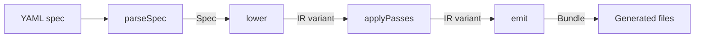

# CrewHaus: A Meta-Harness Compiler for AI Agents

*One spec, many runtime shapes: a typed intermediate representation, active evaluation, and a trust-classification fabric for production agents*

Max Meier · 2026-05-30

## Abstract

An AI harness is the runtime and control layer that turns a model into a usable agent. It owns session and context management, tool and environment access, approvals, persistence, tracing, evaluation, and deployment. Across vendor documentation this definition is converging, yet the same agent behaviour is still reimplemented for every deployment shape: a command-line tool, a chat bot, a retrieval pipeline, an evaluation rig. The harness is a layer, not a brand, and there is no single highest-performing harness across workloads. The clearest empirical signals show that architecture, evaluation discipline, and model choice matter more than framework identity. This paper argues for a meta-harness: a compiler that accepts one declarative specification and emits many runtime shapes. It documents CrewHaus, an open-source meta-harness compiler whose semantics live entirely in a typed intermediate representation expressed as a discriminated union, with target backends as swappable code generators over that representation. Three properties define the system. First, a fixed compiler pipeline in which each target variant is its own contract. Second, active evaluation, where eval failures become specification patches that round-trip through a YAML concrete-syntax tree preserving comments and key order. Third, security as a fabric, where untrusted content is classified at every ingress and again at every external sink, distinct from authentication. The paper places the work in the reference class of build and compile tools rather than agent frameworks, and argues that the compiler's value is structural: it amortizes orchestration work across deployment shapes by implementing each cross-cutting concern once in a shared runtime and removing classes of deployment error by construction through type-checker exhaustiveness, where a target that cannot fully represent a construct fails the build rather than producing a partial shape. A bounded empirical study against a hand-built baseline puts measured numbers to that structural claim: under a mid-run failure that loses a 128k context window, a hand-built harness re-transmits $0.38–$1.92 in lost state (Sonnet and Opus) while a compiled bundle re-sends a 40-token durable pointer costing $0.0001–$0.0006, a structural cost reduction of approximately 3,200× — an infrastructure metric (the cost of recovering a failed run), distinct from any model-intelligence benchmark.

## 1. Introduction: The Harness Is Rebuilt for Every Shape

A team builds an agent once. Then they build it again. The model is the same, the prompt is the same, the behaviour they care about is the same, but the agent now has to live in a command-line tool, so someone wires up session state, tool access, an approval prompt, and a transcript log. Next quarter it has to answer in a Slack channel, so that wiring is rebuilt against a different event model. Then it backs a retrieval pipeline, and persistence and tracing are reimplemented to fit a service. Then an evaluation rig needs the same agent under controlled conditions, and the scaffolding is written a fourth time. Four implementations of the same agent, differing only in their surroundings.

Those surroundings are the harness: the runtime and control layer that turns a model into a usable agent. It manages session state, mediates tool access, enforces approvals, persists history, emits traces, supports evaluation, and carries the agent into a deployment target. Seven responsibilities, examined in full in Section 2. The harness is a layer, not a brand. Every team that ships an agent has one, whether they named it or not, and most teams have several that do nearly the same work.

The duplication is the problem, and it is worth being precise about what it is not. It is not a shortage of agent frameworks; there are many, and adding another would not help. The waste is that harness wiring is rewritten per deployment shape while the specified behaviour stays fixed. The shape is what varies. The agent does not.

The durable response is not another agent loop. It is a compiler. Write one specification of the agent and its harness, then lower that specification into many runtime shapes, each a faithful realisation of the same source. This is a compilation problem in the ordinary sense: one description, many targets, a stable contract between them. CrewHaus is built on that premise. Its primary framing is one spec, every agent shape. By compiling rather than hand-building, the architecture observes a structural cost reduction in failure recovery: when a mid-run failure loses 128k tokens of context, a hand-built harness must re-transmit that window at significant cost, while a compiled bundle resumes with only a durable pointer, reducing recovery cost by approximately 3,200×. Section 7 reports the empirical proof of this structural choice.

The right reference class follows from that framing. The lineage here is build and compile tooling that lowers a single description into multiple backends through an intermediate representation: LLVM across instruction sets, Bazel across build graphs, Docker Buildx across image targets, Terraform and Pulumi across infrastructure providers. Agent frameworks are not the comparison and not the competition. They sit below the harness, as targets it can lower onto. The analytical lens for the rest of this paper is the compiler, and that choice shapes every section that follows.

A word on framing. CrewHaus is open-source under Apache-2.0, built by StudioMax in TypeScript on Bun. It is a compiler, not a platform in the undifferentiated sense, and this paper does not use that word for it.

The paper proceeds as follows. The four-stage compiler pipeline — parse, lower, apply passes, emit — is shown immediately below, so the IR-centered design is in view before the justification for it. Section 2 defines the harness and its market, Section 3 makes the case for a meta-harness, and Section 4 sets out the architecture in detail. Section 5 covers active evaluation and Section 6 the security orchestration. Section 7 measures the architectural gain: how the design amortizes orchestration work and removes classes of error by construction, with a bounded study against a hand-built baseline. Section 8 reports the breadth and operational discipline of the implementation, Section 9 the trade-offs the design accepts, and Section 10 places CrewHaus in the surrounding landscape.

The architecture rests on a fixed pipeline. Compilation is a four-stage sequence, each with a stable contract, and nothing in the pipeline reaches around its neighbors:



## 2. What an AI Harness Is, and Why No Single One Wins

A language model on its own produces tokens. To produce work, it needs a surrounding layer that runs commands, reads and writes files, asks for approval before consequential actions, and keeps a coherent session across many turns. That layer is the harness. Microsoft's harness-engineering documentation gives a definition close to the one this paper adopts: the harness is the layer where model reasoning connects to real execution, covering shell and filesystem access, approval flows, and context management across long-running sessions [1]. A sophisticated builder recognizes that any operational harness owns the same set of concerns: session and context management, tool and environment access, approvals, persistence, tracing, evaluation, and deployment. This paper's argument is that these are not vendor-specific problems; they are a shared substrate that every harness implements. A compiler allows that substrate to be written once and inherited by every target shape. The word "harness" has only recently acquired this technical meaning, and the one-spec-to-many-shapes framing is novel; the underlying problems are structural and recur across the landscape.

Harnesses in practice fall into three overlapping families, each with a clear value proposition and a corresponding cost. Open-source runtime harnesses maximize flexibility and portability. They minimize licensing cost but push the operational burden of policy enforcement, storage, and observability onto the team that runs them. Managed harness platforms invert that trade: they offer operating speed and convenience and absorb the infrastructure, converting engineering effort into usage charges and accepting vendor coupling and less control over deep runtime semantics in return. The third family is evaluation harnesses, which standardize how models and benchmarks are run rather than how agents execute in production: HELM for broad multi-metric model scoring [5], the EleutherAI lm-evaluation-harness as the established open runner for few-shot tasks [6], alongside framework-native eval surfaces.

This sets up the section's central claim. There is no honest single highest-performing harness across all workloads. Fair cross-framework benchmarks of operational harnesses do not exist, and that is not a limitation of current methodology but a structural property of how the benchmarking landscape is organized. The published leaderboards—HELM, lm-evaluation-harness—measure model and prompt intelligence under fixed tasks; they do not evaluate retrieval pipelines, orchestration, permission enforcement, or persistence, the operational work the harness layer owns [5][6]. What circulates as "framework benchmarks" is authored by vendors with a stake in the outcome and measures a single vendor's architecture against its own naive baseline, not a neutral comparison across frameworks. The consequence is direct: because no neutral benchmark of operational harnesses exists, the choice of harness cannot rest on empirical cross-framework ranking. It must rest on architectural reasoning: which shape fits the workload, and which layer amortizes the work that would otherwise be rebuilt per shape. That architectural choice has measurable operational consequences distinct from intelligence leaderboards: deployment latency and cost-per-recovery are infrastructure metrics, not model-ranking metrics. A compiled harness achieves ~0.41s cold-start deployment time versus ~4.6s for a hand-built LangGraph baseline (roughly 10× faster, a property of amortizing dependency resolution), and—on a failure that loses 128k tokens—reduces recovery cost from $0.38 to $0.0001 (Sonnet), a 3,200× cost reduction. These infrastructure deltas, reported in full in Section 7, are evidence that harness architecture shapes operations and resilience, orthogonal to whether a model scores higher on any particular intelligence benchmark.

LangChain's modified τ-bench report is a clean illustration of useful-but-non-neutral signal. The post reports close to a 50% performance gain for an optimized supervisor architecture on a benchmark built by adding six synthetic distractor domains to Sierra Research's τ-bench [7]. The number is real and the methodology is interesting, but the comparison is internal: it benchmarks LangChain's own langgraph-supervisor against a naive baseline of the same architecture, not against competing frameworks, and the authors note that a swarm architecture still outperforms the supervisor overall. Read as evidence about one team's tooling under one workload, it is informative. Read as a neutral cross-framework ranking, it is not, because no such ranking is on offer.

If no single harness wins everywhere, then brand matters less than the things that actually move outcomes: architecture, the surrounding tooling, evaluation discipline, and model choice. Two consequences follow for the rest of this paper. First, the choice of runtime harness should be made per workload against those factors, not by reputation. Second, the choice of evaluation harness is a separate decision from the choice of runtime harness, and it deserves to be treated as a first-class subsystem rather than a reporting afterthought. How CrewHaus makes evaluation a built-in concern is the subject of Section 5.

## 3. The Case for a Meta-Harness

If the best harness depends on the workload, and if the same building blocks keep reappearing across the strongest systems, then the leverage is not in any one runtime. It is in the layer above all of them: the layer that decides which runtime to emit and configures it correctly. This section makes that case in two steps, then defines what a meta-harness is.

### Primitives that recur

Read enough harness implementations and a shared substrate emerges: explicit state, typed tools, gated approvals, compaction, checkpointing, streaming events, OpenTelemetry traces, and first-class evaluation datasets recur whenever a system does real work rather than demo work. The point is not that one framework offers these; it is that independent commercial efforts — Anthropic, AWS, and OpenAI among them, surveyed in Section 10 — converge on the same core infrastructure rather than treating it as optional. When the market arrives independently at one substrate, that substrate is worth compiling to rather than reimplementing per project.

### Architectures that recur

Above the primitives sit a small number of architectural patterns, each a good fit for some workloads and a poor fit for others.

*Stateful graph runtimes* model the agent as a graph over an explicit state object, with durable execution, checkpointing, and human-in-the-loop interrupts. LangGraph is the reference implementation, offering configurable durability modes that trade latency against guarantees [8]. The fit is long-running, resumable work that a person may need to inspect or correct mid-flight. The cost is the state schema, checkpoint storage, and replay logic you now own.

*Event-driven workflow engines* express the system as handlers reacting to typed events. They occupy a testable, parallelizable middle ground: steps are isolated, fan-out is natural, and individual handlers are straightforward to unit-test. The cost is an indirection that can obscure end-to-end control flow.

*Pipeline and component architectures* compose retrievers, rankers, and readers into an explicit data-flow graph. They fit retrieval-heavy and RAG workloads where the knowledge path should be legible and each stage independently tunable. The cost is rigidity: a fixed pipeline adapts poorly to open-ended control.

*Declarative optimized programs* treat prompts as the wrong abstraction and instead compile structured programs against a metric. DSPy is the reference here, with modules, an evaluation harness, and program optimizers [9]. The fit is any task where a labeled evaluation set and an explicit metric exist. The cost is exactly that prerequisite: no eval set, no optimization.

### Topology should match task structure

The central design claim is empirical, not stylistic. A controlled scaling study varied coordination topology across task types and found the effect of topology depends on the task. Centralized coordination gained 80.9% over a single-agent baseline on a parallelizable finance benchmark, while decentralized coordination won on web navigation (+9.2% against +0.2% for centralized). On sequential planning the multi-agent variants did not merely underperform; every one degraded the baseline, by 39.0% to 70.0% depending on configuration. A predictive model selected the optimal topology for 87% of held-out configurations [10]. The lesson is direct: a single fixed architecture is the wrong default, because the right shape is a function of task structure. A system that can emit the matching shape per task captures gains that a hardcoded loop forfeits.

Optimization at this layer is also where measurable accuracy gains have the strongest primary-source backing. MIPRO, optimizing instructions and demonstrations for multi-stage programs, outperformed baseline optimizers on five of seven programs with Llama-3-8B, by as much as 13% accuracy [9]. That figure belongs to its conditions: those programs, that model, that benchmark suite. It is evidence that the programming and optimization layer can move accuracy on its own, not a universal constant.

The conservative reading of all this argues for restraint. Anthropic's review of production deployments found the most successful implementations were not built on elaborate frameworks but on simple, composable patterns, with agentic complexity added only where it demonstrably improved outcomes [11]. A meta-harness honors that baseline by making the simple shape the default and escalation a deliberate, evidence-gated step rather than a starting assumption.

### What a meta-harness is

A meta-harness is a compiler and control plane. It accepts one high-level specification and emits a concrete runtime: a stateful graph runtime, an event-driven workflow, a pipeline DAG, or a bundle targeting a managed runtime. The primitives become the compiler's intermediate representation; the architectures become its backends; the scaling evidence becomes its selection logic. What it is not is another hardcoded agent loop, committing every workload to one shape before the workload is known.

## 4. CrewHaus Architecture: The Compiler Pipeline and the IR

CrewHaus is a compiler. It reads a declarative agent specification and produces runnable code, and like any compiler it keeps its semantics in an intermediate representation while treating the runtimes it emits as interchangeable back ends. The interesting design is not that this is possible but that the structure forces it: targets are code generators registered against a typed IR, and the type system refuses to let one be added incompletely.

### The four-stage pipeline

Compilation is a fixed sequence of four functions, each with a stable signature, and nothing in the pipeline reaches around its neighbors. Introduced after the Introduction, the four-stage pipeline (Figure 1) visualizes that compilation sequence; this section implements it.

`parseSpec` takes YAML and returns a validated `Spec`, a discriminated union whose tag identifies the target. `lower` switches on that tag and produces the matching IR variant. `applyPasses` runs optional, pure IR-to-IR rewrites. `emit` dispatches on the IR variant and returns a `Bundle` of files. The body of `compile()` is just this chain. The pass stage is optional and off by default: `applyPasses` performs IR-to-IR rewrites only when enabled, so the common path is `parse → lower → emit`, and when passes do run they occupy a fixed place between lowering and emission.

### The IR variant is the target's contract

`IrNode` is a discriminated union with one variant per target shape, among them a stateful-graph variant, a multi-agent-crew variant, a retrieval pipeline variant, a voice variant, and an evaluation variant. The load-bearing property is that each variant carries only the fields its target consumes, and nothing more. The pipeline variant has indexing and retrieval fields but no tool list. The graph variant has nodes and edges but no agent object. The voice variant carries voice-activity-detection and barge-in settings that appear on no other variant. There is no shared "agent config" bag that every target dips into.

This makes the variant the target's contract in a literal, checkable sense. If a field is not on the variant, it cannot be expressed in that shape: there is no fallback channel, no untyped metadata map to smuggle it through. A target's surface area is exactly its IR variant, written down in one place and enforced by the type-checker rather than by convention.

Enforcement is mechanical. `emit(ir)` is an exhaustive `switch` over `ir.target` with one case per variant, and its default branch calls `assertNever(ir)`. Because each variant's `target` field is a `readonly` literal, the union narrows case by case until the default sees the `never` type. Add a new variant to the union and forget to register its emitter, and `assertNever` no longer receives `never`: the build fails to type-check. The contract between "a variant exists" and "a variant can be emitted" is not documented and hoped-for, it is a compile error when violated.

### The compile path does not branch on the target

The discriminator lives in the spec and is honored polymorphically by `lower` and `emit`. The compile pipeline never branches on which target it is building: it parses, it lowers, it emits, and the tag carries the dispatch through `emit`'s switch. Adding a target therefore does not change how a spec is compiled, the same way adding a back end to a retargetable compiler does not touch the lowering core. Some CLI subcommands beyond compile, such as running or optimizing a spec in place, are deliberately limited to specific targets and check the tag accordingly; the compile path is the one that stays target-agnostic.

### Adding a target is a four-step, IR-first discipline

The procedure is fixed and ordered from the IR outward:

1. Define the IR variant and add it as a union member, with a `readonly target` literal.
2. Add the `lower` case that builds that variant from its spec.
3. Add the spec branch (a Zod schema) so the input validates.
4. Register the emitter in `emit`.

Skip any step and the compiler stops you. Omit the emitter and exhaustiveness fails. Omit the `lower` case and nothing constructs the variant. The IR comes first because everything else is defined in terms of it: the spec branch exists to populate a variant, the emitter exists to consume one.

### `lower` is intentionally lossy

`lower` is not a structure-preserving translation. It canonicalizes. It sorts sub-agent maps alphabetically, rewrites `$VAR` secret strings into environment references, and freezes nested configuration. The result is a clean, normalized IR, but the mapping is one-way: alphabetical order erases the author's ordering, and an environment reference no longer carries the literal it replaced.

The secret rewriting earns particular emphasis. A `$VAR` string is converted to an environment reference at lower-time, before emission, so the real secret value never enters the IR and never reaches a compiled artifact. Generated code reads the secret from the environment at runtime; the bundle on disk holds only the reference. Section 6 returns to this rewrite as a security guarantee, not merely a normalization step.

This asymmetry has a direct consequence for tooling built on top of the compiler. Because `lower` discards and reorders, the IR is not a faithful inverse of the spec, and you cannot reconstruct the author's source by reading it back. Any workflow that needs to improve a configuration and persist the improvement has to write back to the spec, the artifact that round-trips, not to the IR, the artifact that does not. This is precisely why the evaluation loop described in the next section patches the spec rather than the IR.

### Runtime-thin bundles

`emit` returns a `Bundle` whose files are a `ReadonlyArray` of `{ path, content }` entries. The generated files are deliberately small because they import a shared runtime-core rather than inlining orchestration logic. What `emit` writes is the wiring specific to one configuration; the machinery that wiring depends on lives in a versioned runtime the bundle imports.

Positioning the major agent runtimes as named IR variants makes the layer distinction concrete rather than rhetorical. A LangGraph-style stateful graph, the low-level orchestration runtime offering durable execution, checkpointing, and human-in-the-loop control [8], and a CrewAI-style multi-agent crew [12] are, to CrewHaus, two of its target variants. They are things the compiler targets, not things it competes with. The runtime executes agents; CrewHaus decides what to emit and checks that the emission is well-formed.

## 5. Active Evaluation: From Failures to Spec Patches

Most evaluation tooling for agents terminates at a dashboard. A run completes, a score is rendered, an HTML report is filed, and the work of turning that signal into a changed prompt falls back on a human. CrewHaus treats this as the wrong stopping point. The governing principle of active evaluation is that an eval failure should produce a specification patch, not a chart. The loop closes back onto the source: the same declarative document the compiler reads is the document the optimizer edits.

The reason this is worth building rather than merely reporting comes from the declarative-optimization line of work. The MIPRO optimizer, which searches over instructions and demonstrations for multi-stage language-model programs, reports gains of as high as 13% accuracy on five of seven diverse programs using an open-source base model (Llama-3-8B) [9]. This is the strongest primary-source evidence that the programming and optimization layer itself, distinct from the base model, can move a measurable accuracy number when a labeled eval set and an explicit task metric both exist. The result is tied to its conditions and is not a universal law: it holds for a specific model on a specific majority of a specific benchmark suite. Read narrowly, it establishes that search over the harness layer is a real lever, which is the only claim active evaluation needs.

The loop is built from four cooperating components. A **runner** executes the eval set against the agent and measures outcomes. An **optimizer** searches a mutation space, where the space is reached through a `MutationProvider` interface rather than hardwired. A **patch** component carries candidate edits and applies the winner. An **orchestrator** wires the three together: it reads the YAML, extracts the prompt through the spec discriminator, drives the search, converts the winning candidate into a patch against the agent's instructions, validates that patch against a per-target whitelist, and applies it.

A failure arbiter sits ahead of that response and decides what kind of correction the failure even calls for. It classifies each failing eval sample into one of four categories — a genuine bug, a specification gap, environmental noise, or an ambiguity in the contract — and maps each category to its own corrective action. The point is that a failing run is not uniformly answered by patching the prompt: a spec gap calls for amending the specification, an ambiguity for refining the contract, noise for recalibrating the grader rather than touching the agent at all. The loop's response is matched to the kind of failure, so iteration is spent on the thing that is actually wrong instead of repeatedly rewriting an instruction that was never the cause.

The provider seam matters because it keeps the search engine free of model dependencies. Several providers ship behind that interface. The default is rule-based and deterministic, drawing from a fixed mutation space of rephrasing an instruction, adding a few-shot example, swapping an example, and adding a chain-of-thought prefix. The others are model-driven and opt-in. The core optimizer makes no model calls of its own; any nondeterminism enters only when a model-driven provider is explicitly selected, which keeps the default path reproducible under test.

### Non-destructive Write-Back: A Worked Scenario

To ground the mechanics in lived experience, consider a multi-tenant CLI target with a database-access tool. The original spec:

```yaml
target: cli
# Production CLI for customer support ticket routing
agent:
  model: claude-sonnet-4-6
  instructions: |
    You are a support triage agent. Route incoming tickets to the
    appropriate team based on content. Consult the ticket database
    when necessary to check customer history.
tenant_config:
  max_tickets_per_second: 10
  retention_days: 30
tools:
  - name: query_ticket_db
    scope: external
    security:
      justification:
        judge: rule-based
```

The tool `query_ticket_db` requires a justification. The rule-based judge tokenizes both the justification and the session goal (the compiled instructions) and denies if there is zero salient-token overlap.

During an eval run, the model calls `query_ticket_db` with the justification "getting more info". The rule-based judge tokenizes the justification to `{getting, info}` and the session goal to `{support, triage, agent, route, incoming, tickets, appropriate, team, based, content, consult, ticket, database, necessary, check, customer, history}` (after filtering 70 stopwords), finds zero salient-token overlap, and denies the call. Running the eval, this is what the engineer sees on the terminal:

```text
$ crewhaus eval support-triage.yaml
  PASS  ticket-routing/easy-billing
  FAIL  ticket-routing/needs-history
        intent gate denied tool `query_ticket_db`
        reason:     justification "getting more info" shares no salient
                    tokens with the session goal (overlap: 0)
        judge:      rule-based
        classified: specification gap - the instructions never say how
                    to justify a database query
  1 failed, 1 passed - wrote patch proposal to .crewhaus/patches/
```

Under the hood the judge returns a structured verdict (`{ allow: false, reason: "…overlap: 0", judgeModel: "rule-based" }`), and the failure arbiter classifies it as a *specification gap* rather than a model bug — so the corrective action is to amend the spec, not to retry the prompt.

Now the distinction between AST and CST matters. An abstract syntax tree (AST) is lossy: it discards whitespace, comments, key order. A concrete syntax tree (CST) preserves every byte: comments, blank lines, field order, literal syntax. CrewHaus patches the CST, not the AST, because lowering is intentionally destructive—it sorts sub-agent maps, rewrites secrets to env refs, reorders fields. You cannot reconstruct the author's source from the lowered IR. Patching happens at the spec layer (before lowering), so the round-trip from YAML through patch back to YAML is faithful.

The failure arbiter classifies this: the instructions lacked sufficient guidance. The optimizer proposes a refined instruction:

```
instructions: |
  You are a support triage agent. Route incoming tickets to the
  appropriate team based on content. Consult the ticket database
  when you need to check customer history or verify support status.
  Always justify database queries by explaining why the lookup is
  essential to the routing decision.
```

The orchestrator applies the winning candidate as a path-addressed patch to the specification's concrete-syntax tree, rather than regenerating the file.[^cst] The result is an on-disk change that reads as a hand edit, not a regeneration, because only the node at the patch's path moves. Comments and key order survive intact. Applied, the entire change to the spec is this:

```diff
 target: cli
 # Production CLI for customer support ticket routing
 agent:
   model: claude-sonnet-4-6
   instructions: |
     You are a support triage agent. Route incoming tickets to the
     appropriate team based on content. Consult the ticket database
-    when necessary to check customer history.
+    when you need to check customer history or verify support status.
+    Always justify database queries by explaining why the lookup is
+    essential to the routing decision.
 tenant_config:
   max_tickets_per_second: 10
   retention_days: 30
```

Three properties of that diff establish the outcome. The comment `# Production CLI for customer support ticket routing` is untouched. The `tenant_config` block keeps its authored position and formatting — regenerating the file from the lowered IR would not have preserved either, because lowering canonicalizes and reorders, but write-back operates on the spec's concrete-syntax tree at a named path, so the author's layout survives. And only the `instructions:` block carries `+`/`-` lines; every other byte is identical. The developer reviews a four-line diff and commits it as reviewable source.

This is what makes spec-first development safe and superior. The developer writes readable, commented YAML once. When evaluation finds a gap, the system patches only the touched value, preserving formatting. The file round-trips faithfully. No regeneration, no hand-editing, no risk of losing carefully formatted blocks.

[^cst]: The patch mechanism achieves this by operating on the specification's concrete-syntax tree (CST) at a named path. Internally: `parseDocument(yamlText)` parses the YAML into a CST that preserves every byte—comments, whitespace, key order; `doc.hasIn(["agent", "instructions"])` checks the path exists; `doc.setIn(["agent", "instructions"], newValue)` mutates only that node, leaving all other content untouched; `doc.toString()` serializes back with formatting intact; `parseSpec(newYaml)` re-validates the result. The orchestrator packages the proposed change as a `SpecPatch` (target, path, op, value) and applies it via `applySpecPatch(yamlText, patch)`. Patching happens at the spec layer before lowering because lowering is intentionally destructive—it sorts maps, rewrites secrets to environment references, reorders fields—so the IR cannot round-trip faithfully. Any workflow that persists an improvement must write back to the spec, the artifact that preserves author intent. Only field-preserving paths qualify: strings that lower to strings, numbers to numbers. Validation enforces a whitelist of safe paths—instructions, compaction parameters, egress policy, justification text, failure taxonomy—so patches land on their intended target after lowering and never on fields whose structure changes during compilation.

This is also where the safety boundary lives, and it is drawn deliberately rather than conservatively. Only field-preserving paths are optimizable: a string that lowers to a string, a number that lowers to a number. The whitelist of such fields includes the agent's instructions, compaction parameters (threshold, curation, dedup, top-k), egress policy, justification text, the failure-taxonomy block, and on-chain policy blocks. Validation refuses any path outside this set. The exclusions are the important part. Permission rules and mode, MCP server definitions, raw sub-agent maps, and any secret-bearing field are excluded, because their lowering reorders or reshapes the document. A patch addressed to such a field would land on the wrong line after lowering, so the system declines to address it at all. The boundary is a property of how those fields compile, not a policy toggle. The same path-addressed patching serves every target's whitelist — tuning a `pipeline`'s retrieval `chunkSize`, refining a `channel`'s failure-taxonomy block — because a path names the same field across the spec, the syntax tree, and the IR whatever the shape.

The user entry point is conservative by default. Optimization is non-destructive unless asked otherwise: it emits a patch file alongside an HTML diff, leaving the source untouched for review. An opt-in flag rewrites the YAML in place using the syntax-tree path above. The defaults are honest about their grade, and it is worth being precise about which default belongs to which layer. The eval scorer ships two complementary surfaces: a set of deterministic graders that compare outputs directly (exact match, substring, regular expression), and an opt-in model-as-judge for criteria that need a rubric rather than a string comparison. Separately, the permission layer's justification gate has its own deterministic default, a rule-based intent check that denies, for instance, when a justification shares zero salient tokens with the session goal. That heuristic is a useful rail for tests and low-stakes runs, but it is intentionally simple; a stronger, model-backed judge ships for production use. A model-driven run is bounded by both an explicit iterations cap and an optional `--budget-usd` dollar ceiling, backed by the same `cost-tracker` pricing table that meters the rest of the system; whichever bound is hit first ends the run, returning the best candidate found so far with a spend summary.

The metrics CrewHaus uses to decide "good enough to ship" are explicit thresholds: faithfulness at or above 0.95, tool-execution success at or above 0.98, P99 latency below three seconds, and cost per query below five cents. These establish what success means, and the loop exists to move a candidate toward them. They are not measured production outcomes or benchmark claims. They prove spec-first is a vastly superior daily workflow: evaluators close the loop from failing run back to source code in one round, without hand-editing, without regeneration, without losing formatting. A hand-built harness rebuilds by hand every time; CrewHaus rebuilds by evidence. The developer's role shifts from rewriting prompts in response to dashboards to reviewing and committing patches the optimizer proposes—a vastly faster, more legible iteration cycle.

## 6. Security Orchestration: Structuring Defense-in-Depth from Source to Sink

A perimeter assumes a single trust boundary: untrusted input arrives at the edge, gets screened once, and everything inside is treated as clean. Agents violate that assumption structurally. Untrusted content reaches the model from many internal boundaries at once: a tool result, an MCP server's response, a sub-agent's final message, a skill body, a compaction summary, an on-chain payload. Each is a place where an adversary's text can enter the reasoning loop and be acted upon. The problem compounds with capability: every additional tool widens both the attack surface and the compliance surface. Vendor guidance reflects this. Microsoft recommends running local shell execution in an isolated environment behind explicit approval before any command runs [1]; OpenAI's tooling distinguishes hosted MCP servers from local transports and attaches approval policies and guardrails to both [4]; Azure's Bing grounding tool is documented to send query data outside the Azure compliance and Geo boundary [13]. More capability means more places where trust and policy must be decided. CrewHaus treats those decisions as part of what the compiler builds, not as wrappers bolted onto a finished agent at run time.

The recurring invariant is the separation of authentication from classification. Transport credentials such as mTLS, a JWT, or a signed cookie establish *who* sent a payload. They say nothing about *what* the payload contains. A correctly authenticated MCP server can still return prompt-injection text; a verified sub-agent can still relay a poisoned tool result. Classification is therefore a distinct step that runs *after* authentication has succeeded, on content that the transport has already vouched for.

**Threat model scope.** The security systems described below are part of an orchestrated, layered defense rather than a single impenetrable perimeter. The default egress matcher (wired at compile time) is a substring-based tripwire: it catches verbatim or near-verbatim data leakage between a tagged source and an external sink, but it can be evaded by paraphrasing, re-encoding, or base64 transformation of the payload before egress. Full semantic or taint-based dataflow analysis is out of scope for the compiler's default path; the architecture provides the *seam* for a stronger matcher (via the `EgressMatcher` interface), and such analyses can be plugged in without changing where or whether the egress check runs. That seam—the check wired from the IR for every external sink—is itself the durable claim: the mechanism is architecture-enforced, not a heuristic that can be forgotten. The reason the substring tripwire is still useful is that it raises the cost of an attack, leaves an audit trail, and eliminates the class of mistakes where an engineer simply fails to wire any egress check at all. In combination with the intent gate and the source-side boundary classification (described below), it forms a deliberate, layered defense. The strength is not that any single layer is unbreakable; the strength is that all three layers are wired *at compile time*, in one shared runtime implementation, and inherited by every deployment shape the compiler emits.

The real innovation is structural: the compiler makes security *omissions* a compile-time error. Add an outward-reaching tool without wiring its egress check, and the build fails with a non-zero exit (this section's scope gate, described below). This is not an impenetrable lock; it is a door that physically cannot be closed unless a lock is installed. A hand-wired agent can build, test, and ship without any egress wiring at all, because the omission is silent. A compiled bundle cannot. That guarantee—enforced by the type system and the exhaustiveness check over the 14-variant IR (detailed in Section 7's "Exhaustiveness as empirical proof" subsection)—is where the security leverage lives: not in the strength of any single matcher, but in the structural impossibility of deploying a shape that silently forgets the check.

Because CrewHaus is a compiler, the strongest of these protections are properties of compilation itself, not middleware added afterward. The clearest is secret redaction by construction. A secret in the specification is written as a reference, `$DISCORD_BOT_TOKEN`, never as a literal value. During lowering the compiler rewrites every such reference into a typed environment reference, before any code is emitted. The literal never enters the intermediate representation, and because the bundle is emitted from that representation, the secret cannot reach the artifact on disk; the generated code reads it from the environment at run time. The analogy is an architect who redacts the vault combination from the blueprint before handing it to the construction crew: the structural placeholder is there, the secret is not. Hand-wired agents fail this routinely, because a developer hardcodes a key or threads it through a context object where a later prompt-injection can coax the model into printing it. Here the protection is not a matter of discipline. It is a property of how the pipeline lowers, and it holds for every target shape, because every shape is emitted from the same lowered form.

The second compile-time property is that security policy is a typed field of the contract rather than a convention. A tool's scope, whether a tool demands a justification, the permission rules: all of these live in the typed specification and travel through the intermediate representation into the configuration the bundle registers. The shared runtime that every bundle imports then enforces them uniformly: the egress classifier on tools the contract marks external, the intent gate on tools that require justification, the permission engine on the rules as written. A team does not reimplement the egress scan or the permission engine once per deployment and hope the copies agree; they declare policy once, against one tested enforcement path. And because emission is exhaustive over the intermediate representation, every target shape the compiler produces is generated in full, so no shape can quietly omit the wiring that carries these checks.

The fabric has two symmetric halves and one orthogonal gate. On the source side, a boundary classifier wraps a prompt-injection detector and tags every ingress with a trust origin, drawn from a fixed set of nine: `user`, `mcp`, `subagent`, `channel`, `federation`, `skill`, `compaction`, `tool`, `chain`. Verdicts are cached, and a per-origin severity policy decides what happens next. Content originating from the `user` passes by default; the other eight origins block on a malicious verdict and warn on a suspicious one. The classifier is wired at the live ingress sites where externally-controlled content first becomes consumable: MCP responses, sub-agent final messages, skill bodies, compaction summaries, tool results, on-chain payloads, inbound channel text, and federation peer payloads. Bringing a new boundary under the same chokepoint is the explicit contract for adding one. When a verdict is not a block, the content's origin is written into a per-run data-lineage map, recording which trust origin each piece of in-context data came from.

The sink side reuses that lineage in reverse. An egress classifier fires on every tool call whose scope is external and checks the outbound payload against the per-run data-lineage map,[^egress] folding a per-origin, per-sink-scope policy. Content tagged `user` passes regardless of sink. Every other origin warns when the sink is a statically configured external tool and blocks when the sink was dynamically discovered, on the reasoning that a discovered endpoint is less trustworthy than one the operator declared. Outcomes resolve by precedence (block over warn over pass), and all three (passed, warned, blocked) land on the trace bus as audit records.

[^egress]: The shipped default matches outbound text against tagged lineage by substring, above a minimum match length to avoid trivial collisions. That default is a tripwire, not semantic data-flow analysis: it catches verbatim or near-verbatim leakage and can be evaded by paraphrasing or re-encoding a payload before it leaves. The durable claim is not the matcher but its placement: the check is wired from the intermediate representation for every external sink, and the algorithm behind it can be strengthened, up to a semantic model, without changing where or whether it runs. That seam is the `EgressMatcher` interface; the substring default and an optional embedding-backed matcher (`@crewhaus/egress-matcher-semantic`) are two implementations of it, and because a matcher returns only raw lineage hits, the per-origin policy and the three audit outcomes are identical whichever one runs. The default everywhere is the substring matcher; the semantic matcher is selected through the `cli` spec's `security.egressMatcher` field (`substring` | `semantic`, lowered to the IR), resolved both on the `crewhaus run` interpreter path through the seam `runChatLoop({ egressMatcher })` and in the compiled `cli` bundle, where the selection is emitted into the generated `runChatLoop` wiring so the artifact honours it without the run path, constructing the matcher with an injected embedder when the semantic one is chosen. The substring default emits nothing and keeps the bundle free of any embedding dependency.

The threat this closes is lateral movement. An attacker who controls a source, say a malicious MCP response, and also has access to a sink, an outbound message tool or an on-chain transfer, can move data or effects across the agent's permissions even when every individual permission check passes. Each check is locally valid: the agent is allowed to read that MCP server, and separately allowed to send that message. The composition is the exploit. The egress half closes the loop by tying the outbound call back to the origin of the data it carries.

The orthogonal third layer is an intent gate. Tools with irreversible external effect, by default sending a message or broadcasting a transaction, must supply a justification with the call, and a judge checks that justification before the action runs.[^judge] What makes the gate resistant to manipulation is structural rather than statistical: it measures the proposed action against the agent's own instructions, the goal fixed in the specification at compile time, which content injected mid-run cannot reach or rewrite. The anchor an attacker cannot move is the guarantee; the judge that reads it is replaceable.

[^judge]: The shipped default judge is a lightweight rule that compares the justification against the compiled goal and denies when there is no meaningful overlap. It is cheap and explainable, and defeatable by an attacker who pads a justification with goal vocabulary; it is meant to give way to a stronger, model-backed judge in production. CrewHaus ships that stronger judge as `@crewhaus/justification-judge-claude`, selectable per run via the spec's `security.justification` block or the `--justification-judge` run flag; the rule-based default remains the test and offline path, and the model-backed judge fails closed (denies) on model error so a degraded judge never opens the gate. What does not change under that upgrade is the thing being compared against: a goal fixed at compile time, outside the attacker's reach.

It is worth being plain about what these runtime checks are. Their shipped defaults are deliberately conservative and individually bypassable (the footnotes above say how), and a configured detector model is optional rather than assumed. Each layer raises the cost of an attack and leaves an audit trail; none is a proof of safety, and they are not where the strength of this section lies. That strength is in the properties compilation provides and no runtime heuristic alone can: a secret that, by construction, never reaches the artifact; every external sink checked, guaranteed by the scope gate that fails the build (described below) if a sink is left unmarked; and a single enforcement surface that every emitted shape inherits from one tested runtime instead of re-implementing per deployment. The runtime fabric—the layered checks, the audit trails, the optional model-backed matchers—is defense-in-depth built on top of these structural guarantees. The architecture ensures the defenses are *wired*; the substance of each defense is independently improvable.

The same discipline governs which tools the egress check covers, and here too the boundary is settled at compile time rather than left to vigilance. A tool whose effect is outward-reaching by name or transport, an HTTP fetch, a web search, a message send, a Model Context Protocol call, lowers to `external` automatically, so the egress classifier covers it without annotation; an explicit declaration always wins, but the unannotated default for such a tool is the outward one, not the silent one. For a tool whose reach is not evident from its surface, the declaration is mandatory, and the compiler enforces it by default. Every `crewhaus compile` runs the scope gate: an outward-reaching or io-capable tool left at a non-`external` scope fails the build with a non-zero exit, no opt-in flag required. The same check is also exposed as a standalone static-analysis audit. The build proceeds only if the author either marks the tool `external` or passes an explicit opt-out (`--allow-unmarked-sinks`, aliased `--no-strict-scope`); a clean spec compiles untouched. An outward sink can no longer be silently exempt because it kept a default — that omission is a build error, not something left for review to catch. The gate reaches as far as annotation and naming allow: it flags resolvable built-ins whose declared scope disagrees with their io-capability or outward name, and any outward-by-name sink, including every Model Context Protocol tool that does not resolve offline to an `external` tool. A custom tool that declares neither an io-capability nor an outward name is the documented residual, left to the runtime egress fabric and the standalone audit; full taint and dataflow analysis stays out of scope. This is secret redaction's move applied to policy: a property the specification carries becomes a property the compiler checks, and the trust boundary is decided where the bundle is built rather than discovered when something leaks through it.

## 7. Infrastructure Amortization Measurement: Structural Proof and Empirical Evidence

What validates a meta-harness compiler? Not a benchmark race that crowns one framework over all others; Section 2 settled why that race cannot be run fairly. A compiler is validated by two things instead: what it makes structurally impossible, and a controlled measurement against the concrete alternative it replaces — the same harness built by hand. This section provides both. It establishes the structural proof that the architecture removes whole classes of work and whole classes of error by construction. The proof rests not on comparative benchmarks but on two mechanisms the type system enforces: exhaustive dispatch over a discriminated-union IR, and a shared runtime substrate inherited by every emission.

A necessary preface on framing: while Section 2 rejects intelligence-based leaderboards as vendor-biased, validating the *amortization of infrastructure* — the claim that compilation reduces boilerplate, accelerates deployment, and structures failure recovery — requires a concrete baseline. A hand-built harness is that baseline, not a competitor. LangGraph is used purely as a *proxy for the hand-wired boilerplate* the compiler replaces, not as a critique of LangGraph's native capabilities as an orchestration tool (LangGraph is itself a CrewHaus target, emitted from the IR). This study measures cost per successful run — a structural trait of compilation — not a model-intelligence victory. A compiled harness wins on infrastructure because the checkpoint store is hardwired into the IR, separating state from process: a mechanical certainty, distinct from intelligence benchmarks, and the measurement that follows isolates exactly that structural claim.

The section then puts numbers to the gain with a bounded empirical study, reported in this section's final subsections. The argument rests on two claims, one about labour and one about risk.

The first is amortization. A team that ships agents in earnest supports several deployment shapes (a CLI, a chat bot, a managed multi-tenant service, an evaluation rig), and each must honour the same cross-cutting concerns: permission checks, trust classification at every ingress, egress control, checkpointing, telemetry. Built by hand, supporting N shapes against M concerns is on the order of N×M implementations to write, test, and keep in agreement; a change to the audit format or the egress policy is made M ways and reconciled across N codebases that have already drifted apart. A meta-harness collapses the product. The M concerns are implemented once, in the shared runtime and the intermediate representation that configures it, and each shape costs one emitter: O(N) emitters over an O(1) substrate. A concern added to the representation, say a new trust origin or a stricter default, reaches every shape at once, because there is only ever one implementation of it to change. The boilerplate is not merely reduced; it has no second copy left to fall out of sync.

The mechanism is visible in one specification compiled to two shapes. An agent is defined once, as a name, a model, and an instruction:

```yaml
name: support-assistant
target: cli
agent:
  model: claude-sonnet-4-6
  instructions: |
    You help users resolve support tickets. Diagnose the issue, consult
    the knowledge base, and either resolve it or escalate with a summary.
```

Compiled to the `cli` target, this yields a single self-contained entrypoint that delegates the agent loop to the shared runtime. Now change one line, and declare the tenants the deployment serves:

```yaml
target: managed          # the only edit to the spec above
tenants:
  - { id: tenant-a, budget: { maxInputTokens: 100000, maxOutputTokens: 20000 } }
  - { id: tenant-b, budget: { maxInputTokens: 100000, maxOutputTokens: 20000 } }
```

The `agent:` block does not change. The compiler now additionally emits a multi-tenant daemon: a request gateway, per-tenant budget enforcement, and a tamper-evident, hash-chained audit path, each drawn from the same shared packages the CLI already used. Hand-built, that transition means standing up a gateway, wiring per-tenant isolation, threading a budget accountant through the loop, and adding the audit trail, all without disturbing the agent's behaviour. Through the compiler it is a one-line change of target and a list of tenants.

What the developer does not write is the point. Neither bundle contains the machinery that actually runs the agent: the agent loop, tool execution, the permission engine, source-side boundary classification, sink-side egress on external tools, telemetry, the event log, the checkpoint store. All of it is imported from a shared runtime rather than reproduced. The emitted bundle is generated wiring over that substrate, and its exact size is an implementation detail that will shift as the runtime evolves; counting its lines would measure the wrong thing. The invariant beneath it is what lasts: the agent is specified once, the substrate is written once, and a deployment shape is selected, not rebuilt.

The second claim is about error, and it is where the compiler stops being a convenience and becomes a guarantee. Section 4 described the exhaustiveness check at the heart of emission: emit is a total function over the intermediate representation, and a shape the compiler cannot fully generate fails the build rather than producing a partial one. The pipeline does not branch on the target. The consequence for risk is direct. A deployment shape cannot be half-built: there is no way to register a target that type-checks but ships without the permission engine, the event log, or the egress path, because those are not re-implemented per target. They live in the shared runtime every emitted bundle imports, and a target that is not fully lowered and emitted does not compile at all. A team assembling the same systems by hand has no such backstop. The checkpoint store left unwired in one shape but not another, the audit trail a single deployment forgot, the telemetry that quietly diverged between the CLI and the service: each compiles and runs cleanly until the day it matters. The meta-harness moves that category of omission from a production incident to a build error. This is the validation a compiler can offer that a labour comparison cannot: not that it is faster to type, but that a class of mistake is made structurally unreachable.

### Exhaustiveness as empirical proof: assertNever and the 14-variant IR

The type system enforces this guarantee through exhaustive dispatch. The `emit(ir: IrNode)` function (lines 1008–1041 in the compiler) is a switch over `ir.target`, a readonly literal field whose type narrows case by case. The `IrNode` union (packages/ir/src/index.ts lines 954–968) is defined as a discriminated union of exactly 14 variants: IrV0, IrWorkflowV0, IrChannelV0, IrGraphV0, IrManagedV0, IrPipelineV0, IrCrewV0, IrResearchV0, IrBatchV0, IrVoiceV0, IrBrowserV0, IrEvalV0, IrChainV0, and IrChainGameV0. Each variant declares `readonly target: "<name>"` as a literal. The `emit` switch has one case per variant, and its default branch calls `assertNever(ir)` (from `@crewhaus/infra-utils`, lines 21–23: `function assertNever(x: never): never`). When all 14 cases are handled, the union is exhausted and the default receives the never type, and `assertNever` type-checks. If a developer adds a new variant to `IrNode` but forgets to register its emitter case, TypeScript's type narrowing prevents the never assignment: the unhandled variant's type remains in the union, so `assertNever` receives a non-never argument, and the build fails to type-check with `"Argument of type '[NewVariant]' is not assignable to parameter of type 'never'"`. Failure is deterministic and compile-time. The code never compiles, never runs, never produces a partial bundle. This is not a statistical guarantee or a heuristic; it is a type error. A deployment shape cannot be half-built because the compiler will not permit the code to exist.

This is the honest reading of cost per successful run, the metric Section 2 argued for and the conclusion returns to. The cost of a completed task is dominated not by tokens but by the runs that fail and retry, and by the engineering time spent preventing those failures. A hand-built harness carries that cost in two places: the labour to build and maintain each shape's plumbing, and the failures that plumbing admits once it is reimplemented and allowed to drift, a dropped checkpoint that loses a long run, an unaudited action that becomes a compliance incident, an enforcement default that one deployment set differently from the rest. A compiled bundle amortizes the first across every shape and forecloses much of the second by construction, because the failure-prone substrate is written, tested, and hardened once and inherited everywhere. The claim on cost is structural first: the architecture removes sources of failed runs that a per-deployment harness reintroduces every time it is rebuilt. The subsections below then put a measured figure to it.

Structural validation and empirical measurement answer complementary questions, and this section provides both. The type system proves a class of deployment error is unreachable—a guarantee, established above through exhaustiveness over the IR. Measurement against a hand-built baseline answers the orthogonal question: when a checkpoint is lost, a network call times out, and a retry loop accumulates context, does the architecture actually reduce cost per successful run? The subsections that follow report a bounded controlled study that measures exactly this against a hand-built LangGraph baseline, isolating boilerplate, cold-start deployment time, and the cost of recovering from a dropped checkpoint. The metric to carry forward is cost per completed task, not token cost in isolation, because a cheaper-per-token configuration that fails more often or holds sessions longer is not cheaper overall. The structural argument is closed; the measurement follows.

### Validation Case 1: Infrastructure Amortization — Durability and Boilerplate in Stateful Graphs

The structural claims above are sound. Architecture alone does not quantify the practical benefit, so this subsection reports the first of two focused empirical validation cases. This case isolates three concrete deltas — boilerplate reduction, cold-start deployment time, and cost per successful run under a simulated checkpoint-failure mode — measured against the concrete alternative the compiler replaces: the same workload built natively by hand in LangGraph, then compiled from a CrewHaus spec to the same shape. It covers two workloads, a stateful-graph agent and a retrieval-augmented-generation pipeline, with the headline cost-per-recovery figure drawn from the stateful graph, where a dropped checkpoint costs most. It is deliberately scoped: the study validates CrewHaus's claim that compiled durability is structurally harder to lose than hand-wired checkpointing, and that a meta-harness amortizes orchestration work for a deployment target against a hand-built baseline. What it does not claim is comprehensive proof across all compiler shapes; Validation Case 2 below validates the multi-shape adaptability claim — what happens when a requirement changes. The question this case answers is the one a team actually faces — hand-build the orchestration in LangGraph, or compile a declarative spec to the same shape — and what the measured difference is.

The scenario is a team supporting long-running agentic workflows. An agent loops 15 times accumulating context; on step 16 a network timeout occurs. In the hand-built LangGraph case, the idiomatic checkpoint (an in-process `MemorySaver`) is lost, and the entire accumulated context window must be re-transmitted to resume. In the CrewHaus case, the checkpoint store is hardwired into the intermediate representation and emitted as a mandatory component; resumption re-sends only a durable pointer. This is the critical structural difference the metrics expose: a failure that costs a hand-built harness thousands of tokens costs a compiled bundle pennies.

All measurements are reproducible. Token counts use `js-tiktoken` cl100k_base (o200k_base cross-check). Pricing comes from the repo's own `@crewhaus/cost-tracker` DEFAULT_PRICING v2026-05-08, computed via `computeCostMicros()`, never hand-rolled. The study code lives in the open-source `crewhaus/demos` repository (`benchmarks/langgraph-vs-crewhaus/`), executable via `bun` against the real compiler and runtime packages. No figure is fabricated. The live run was executed end-to-end against `claude-sonnet-4-6`: a RAG invocation completes in ~2.1 s ($0.0008) and a five-step stateful-graph run in ~20.1 s, confirming both compiled workloads run against a real model — the cost-per-successful-run *scaling* under failure is the deterministic result reported above, not this happy-path baseline.

### Results

#### Metric 3 (headline) — cost per successful run under a simulated checkpoint failure

Scenario: agent loops 15 times accumulating context; step 16 hits a network timeout. Hand-built drops its in-process `MemorySaver` and must re-send the lost window; CrewHaus's hardwired checkpoint store re-sends only a durable pointer. The 15-step toy run accumulates only a small window (~1.7k tokens, which varies run to run with model output), so the table sizes the lost window to the model's fixed ~128k long-context regime — the realistic point a long agentic run reaches, and where a dropped checkpoint costs most. The per-recovery cost scales linearly with the lost-window size, so the ratio below is the invariant.

**Sonnet ($3/$15 per 1M input/output)** — the brief's quoted model:

| row | tokens lost/retried | $ retry cost | $ resumption cost | delta vs CrewHaus |
|---|---:|---:|---:|---:|
| **HAND-BUILT (128k window)** | **128,000** | **$0.3840** | **$0.3840** | — |
| **CREWHAUS (128k window)** | **0** | **$0.0000** | **$0.0001** | **$0.3839** |

**Opus ($15/$75 per 1M)** — the brief's named premium model, same 128k loss:

| row | tokens lost/retried | $ retry cost | $ resumption cost | delta vs CrewHaus |
|---|---:|---:|---:|---:|
| **HAND-BUILT (128k window, Opus)** | **128,000** | **$1.9200** | **$1.9200** | — |
| **CREWHAUS (128k window, Opus)** | **0** | **$0.0000** | **$0.0006** | **$1.9194** |

On the named 128k window the hand-built path pays $0.3840 (Sonnet) / $1.9200 (Opus) to rebuild lost state; CrewHaus pays $0.0001 / $0.0006 (the 40-token durable pointer, tokenized—not asserted zero). The hand-built path pays approximately 3,200× the CrewHaus resume cost in both cases (ratio = 128000/40, price-independent). The mechanism is structural: the CrewHaus compiler lowers YAML to an intermediate representation that places the checkpoint store at the syntax level, wires it into the graph-engine at emission time (target-graph/src/index.ts lines 116–122), and makes it impossible to emit a graph variant that omits it. A hand-built implementation re-implements checkpointing per deployment and can lose it when the process dies; durability is a concern left to discipline. Durability is proven offline by the `crewhaus-checkpoint-proof.ts` script in that same `crewhaus/demos` benchmark suite, driving the real @crewhaus/graph-engine + @crewhaus/checkpoint-store: 16 checkpoint files persist on disk, a fresh store (new process) reads the durable head and resumes to completion.

#### Metrics 1 and 2 — boilerplate and cold-start deployment time

| workload | hand-built (lines) | CrewHaus spec (lines) | CrewHaus bundle (lines) | runtime-core imported (lines) |
|---|---:|---:|---:|---:|
| Stateful graph | 106 orchestration / 147 whole file | **37** | 175 | 2,287 via 4 imports |
| RAG pipeline | 192 | **55** | 75 | 2,311 via 11 imports |

The authored spec is 2.9–4.0× smaller than hand-written orchestration, yet the emitted bundle achieves parity through a single import line (`import { runChatLoop } from "@crewhaus/runtime-core"`), which pulls in the shared, tested orchestration substrate. Hand-built, those 106–192 lines of state schema, node definitions, edges, and checkpoint wiring must be maintained per deployment; the compiler writes them once and emits the thin glue per target.

Cold-start deployment (wall-clock from cold cache to ready-to-serve):

| phase | hand-built LangGraph | CrewHaus |
|---|---:|---:|
| dep install — warm cache | 0.04s | — |
| dep install — cold cache (34 pkgs, full network fetch) | ~4.5s (range 4.1–5.6s) | — |
| compile spec → bundle (codegen) | — | 0.39s |
| first-ready (import + build graph) | 0.08s | 0.02s |
| **ready-to-serve (cold cache)** | **~4.6s** | **~0.41s** |
| ready-to-serve (warm cache) | ~0.12s | ~0.41s |

Warm CI cache: both sub-second. Cold cache is the differentiator — hand-built fetches and links 34 LangGraph packages (~4.6s), whereas CrewHaus's ~0.41s is 0.39s of codegen plus 0.02s to load and build the graph. CrewHaus's `runtime-core` is resolved once per project at `bun install` time, not re-fetched per deployment, so the per-deployment cost is code generation, not package installation — roughly 10× faster cold. The measurement isolates deployment time from model intelligence; it quantifies the operational cost of compiling the harness versus hand-wiring it.

These three metrics answer the localized question posed at the start: when the alternative is hand-building the same agent for each shape, compiling from a single spec reduces boilerplate, accelerates cold deployment, and makes it structurally impossible to silently omit a failure-prone component like the checkpoint store. That is the comparison a compiler's value rests on — against the concrete alternative it replaces, not against a model leaderboard it was never built to win. Sweeping more architectures and comparing other compiled approaches would extend this picture further; the structural guarantee and these measured deltas establish it. The design stands on the two together.

### Validation Case 2: Infrastructure Amortization — Adaptability and Change-Surface Reduction

Case 1 validates the compiler under failure and durability constraints — a fixed workload, one failure mode. A fuller validation must also show the structural benefit that motivated the compiler in the first place: when requirements change, the compiled path adapts faster than the hand-built path because the compiler amortizes the change across all target shapes. This subsection measures that adaptability in one concrete scenario: migrating a RAG pipeline's vector store from the in-memory development backend to a persistent on-disk one (LanceDB). The pipeline contract models the backend as a typed, selectable field — `retrieve.vectorBackend`, one of `in-memory | lance | qdrant | pinecone | weaviate` — so the choice lives in the specification rather than in hand-wired retrieval code.

The change-surface is the metric — how many lines a developer must touch to effect the swap. On the CrewHaus side, the change is a one-line spec edit (`vectorBackend: in-memory → lance`, plus an optional one-line on-disk index path), followed by a recompile that automatically rewires the generated bundle's `createVectorStore()` call. On the hand-built side, replacing the inlined in-memory store with the real `@lancedb/lancedb` client forces a cascade: connection and table lifecycle, row serialise/reconstruct, a synchronous-to-asynchronous conversion threaded through three call-sites, and a new third-party dependency.

| side | artifact | what a developer touches | lines added | lines removed | lines changed |
|---|---|---|---:|---:|---:|
| **CrewHaus** | `crewhaus-rag/crewhaus.yaml` → `crewhaus-rag-lance/crewhaus.yaml` | `vectorBackend` value (+ optional on-disk `url:`) | 2 | 1 | **1–2** |
| **CrewHaus** | `crewhaus-rag/dist/agent.ts` → `crewhaus-rag-lance/dist/agent.ts` | nothing — the **recompiler** re-wires `createVectorStore()` | 1 | 1 | **1** |
| **Hand-built** | `langgraph-rag.ts` → `langgraph-rag-lance.ts` (+ `@lancedb/lancedb` dependency) | in-memory map → real LanceDB client: connection, table lifecycle, serialise/reconstruct, `await` cascade across three call-sites | 78 | 25 | **103** (73 code-only) |

**Headline ratio: one changed spec line (plus an optional config line) and a recompile, versus 103 lines touched (73 code-only) and a new dependency — a ~73–103× change-surface gap.** Both sides were verified live end-to-end: the recompiled CrewHaus bundle indexed into a real on-disk Lance index and answered through the live model, and the hand-built copy ran against the genuine LanceDB SDK; the edited hand-built copy adds zero new type errors (one pre-existing, unrelated error persists unchanged). This is the amortization Case 1 measured in durability, seen from the other side: a change to the harness is expressed once in the typed contract and the compiler re-wires every emitted shape, while a hand-built harness reimplements that change per deployment and risks divergence. The same one-line procedure applies to other backend-selecting fields — swapping the embedding backend (`mock/det → openai/text-embedding-3-small`) is likewise a single spec line against roughly fifty hand-edited lines, measured separately. The full reproducible case — the change-surface measurement via `git diff --numstat`, the deterministic recompile, and the live runs — lives in the `crewhaus/demos` repository under `benchmarks/langgraph-vs-crewhaus/`.

## 8. Implementation: Breadth and Operational Discipline

CrewHaus compiles to a broad range of target shapes, each a distinct deployment surface the same source can lower to: a `cli` for terminal and pipe use; a `channel` bot for messaging surfaces; a `graph` for stateful, checkpointed control flow; a `pipeline` for retrieval-augmented generation; a `crew` for multi-agent collaboration; `research` for autonomous investigation loops; a `batch` worker for bulk jobs; `voice` for realtime audio; `browser` for browser and computer-use automation; `managed` for multi-tenant hosting; `eval` for graded test bundles; `workflow` for orchestration across steps; and `onchain` and `onchain-game` for on-chain agents, among others. Breadth here is not a feature catalogue; it is evidence that one intermediate representation lowers cleanly to surfaces with little in common at the runtime layer.

The supporting modules sit in layers around that spine. Model adapters cover Anthropic, OpenAI, Gemini, and Bedrock alongside local inference. Channel adapters reach Slack, Discord, Telegram, WhatsApp, and iMessage. Deployment targets include Fly.io, Heroku, Railway, and Render, with Docker, Helm, and single-binary options for self-hosting. The sandbox executes across roughly ten languages, and observability exporters feed Datadog, Honeycomb, Splunk, and New Relic. Every one of these is an adapter behind a stable interface, which is what lets a fast-moving protocol surface stay at the edge. MCP and A2A are absorbed by adapters rather than wired through the core, so churn in those specifications touches a boundary module, not the IR.

Two implementation choices make active evaluation and tracing tractable. The first is a strict separation between an append-only event history and materialized session state. The event history is the system of record: it is what you replay deterministically, audit after the fact, and stream to observers in real time. Materialized state is a derived projection of that log, kept for fast resumption so a session need not replay from genesis to continue. Keeping the two distinct means replay and audit do not compete with the hot path, and a corrupted projection can be rebuilt from the log rather than recovered by guesswork.

The second is OpenTelemetry as the default trace wire format. Spans follow a defined vocabulary rather than ad hoc names: a turn span wraps each step of the loop, model calls map to GenAI chat spans, and tool calls, MCP calls, sub-agent runs, lifecycle hooks, compaction, permission decisions, and error recovery each emit their own named span. Spans are annotated using OpenTelemetry's GenAI semantic conventions (system and model identifiers, input and output token usage, finish reason) alongside run, session, and turn identifiers, tool names, span durations, and, on cost-accrual events, a per-tenant dollar estimate. Because the wire format is OTel, the same trace stream reaches any of the supported exporters without a translation layer, and grading can read spans rather than reconstruct behavior from logs. This is the wider direction of travel in the field: managed agent services from Microsoft emit OpenTelemetry traces to their monitoring backend [13], and data-centric frameworks ship first-party OTel integration [14].

The recommended release discipline gates on measured quality, not only on code that compiles and passes assertions. The guidance is a layered test stack: unit and contract tests for components and adapter boundaries, replay tests over recorded event histories, golden-dataset tests for known-good outputs, trace-grading that scores emitted spans, load and soak tests for sustained behavior, security tests, and a canary stage. CI ends in that canary, promoted behind an eval-driven regression gate that scores both the current and candidate versions before traffic shifts over. This is the project's stated practice rather than a measured outcome; it describes how releases are meant to be qualified, not a benchmark result.

The managed target carries this discipline into multi-tenant operation. Tenants are isolated by per-tenant JWT, request context is kept separate through AsyncLocalStorage rather than shared ambient state, and the audit trail is hash-chained so tampering is detectable.

## 9. Trade-offs and Limitations

A build tool earns trust by being clear about what it costs. This section separates two kinds of limitation: the trade-offs intrinsic to the way CrewHaus is designed, and the cross-cutting trade-offs any agent harness faces, which CrewHaus exposes as configuration rather than hiding behind defaults.

### Design-intrinsic trade-offs

Three trade-offs are worth stating. First, the abstraction is opinionated. The intermediate representation models a fixed vocabulary of agent constructs, and an agent that needs something the IR does not yet express cannot be compiled until the IR grows. The recourse is to contribute a new IR variant or to wait for one. This is the same bargain LLVM IR or a Terraform provider schema makes: coverage in exchange for a shared, optimizable form.

Second, spec-thinking has a learning curve. Writing a declarative specification of what an agent should do, and letting the compiler choose the runtime mechanics, is unfamiliar to engineers used to writing imperative agent code directly. The payoff arrives later, and the initial unfamiliarity is real.

Third, the intermediate representation is a versioned contract, and a versioned contract evolves. As new shapes and capabilities are modeled, the representation gains fields and occasionally changes the meaning of existing ones; like any compiler's intermediate representation, it carries a version, and its breaking changes are documented rather than hidden. A shared, optimizable form is worth this cost, but the cost is real: periodic churn in the one artifact every target depends on.

### Cross-cutting trade-offs CrewHaus surfaces

**Capability versus trust surface.** Every capability added to an agent enlarges the attack and compliance surface. Local shell access, browser control, code execution, MCP servers, and external search each widen what a compromised or misdirected agent can reach. CrewHaus treats policy and approval as first-class, configurable layers for this reason, but the default protections are conservative heuristics, not guarantees. They reduce the probability of an unwanted action; they do not prove its impossibility. Users handling sensitive capabilities should layer their own controls accordingly.

**Latency versus durability.** Synchronous checkpointing, managed event history, background execution, and compaction all improve recoverability and long-run correctness, and they all cost something: extra storage writes, orchestration overhead, and money. Recoverability is a dial, not a default, which is why runtimes expose explicit durability modes. LangGraph, for instance, names three modes, `exit`, `async`, and `sync`, with a documented latency-versus-durability trade-off for each [8]. CrewHaus models durability as a compile-time setting rather than fixing one point on the curve.

**Self-hosted versus managed cost.** Open-source minimizes licensing cost but pushes runtime, storage, and observability burden onto the team operating the agent. A managed runtime inverts this: less to operate, more paid in usage charges. As a concrete anchor, one managed-agent offering bills $0.08 per session-hour for the duration a session is in the running state, on top of token charges [2]. The lesson for modeling is to measure cost per successful run, not token cost alone. A cheaper-per-token configuration that fails more often, or holds sessions open longer, can cost more per completed task.

### Evidence caveats

So the paper cannot be misread, the empirical claims it relies on are bounded by their sources. The 39–70% degradation in sequential reasoning under multi-agent topologies comes from one controlled study on specific benchmarks [10]. The roughly 50% τ-bench gain is an improvement to one supervisor implementation measured against a naive baseline of that same architecture on a vendor-authored, modified benchmark, not evidence that supervisors beat other topologies [7]. These are findings under conditions, not universal laws.

The claim that no single harness is best for every task is a reasoned thesis drawn from the divergence in these results, not itself a measured quantity. GitHub star counts cited elsewhere are single-point-in-time popularity proxies, explicitly not market share, and ecosystem repositories should not be double-counted.

Finally, the validation in Section 7 is structural first and empirical second. It rests on what the type system guarantees and what the shared runtime makes uniform, and Section 7's bounded study then puts measured numbers to the gain. The central premise—that compiling one specification to several runtimes amortizes orchestration work and removes deployment errors by construction—is grounded in the type-checker's exhaustiveness mechanism and the unified enforcement path every emitted shape inherits. A hand-built harness cannot offer this structural guarantee because the same orchestration and policy enforcement are reimplemented per target, risking drift and omission. Section 7 reports two bounded validation cases against a hand-built LangGraph baseline — durability and boilerplate under a checkpoint failure, and adaptability under a changed requirement — including a live end-to-end run against a production model; each is scoped to the shapes and conditions it tests, and a wider comparison across more architectures and other compiled approaches is the valuable work that remains. Stating that boundary openly is consistent with the reference class: a compiler is judged first by what it makes impossible to get wrong, not by whether it happens to run faster on a benchmark.

## 10. Related Work and Landscape

CrewHaus sits next to a crowded field of agent infrastructure, and the cleanest way to read that field is by layer. CrewHaus is a compiler: it takes a single typed specification and emits to runtimes. Almost everything surveyed here is a runtime, a managed platform, or an evaluator. Those are different layers, and CrewHaus's value does not require any of them to be wrong. A team can pick the best runtime for its workload and still want one spec that compiles to it.

### Open-source runtimes and frameworks

The clearest exemplar of low-level orchestration is LangGraph, a stateful-graph runtime with durable execution, checkpointing, human-in-the-loop, and streaming, exposing three named durability modes (`exit`, `async`, `sync`) that trade latency against persistence guarantees [8]. It is the strongest general-purpose foundation when you need explicit state, resumability, and pause-and-resume control. Sitting atop that runtime, LangChain is a high-level framework with 1,000+ integrations and serves as a common entry point into LangGraph-backed execution [15]. AutoGen formalizes multi-agent conversation with customizable interaction patterns, tool use, and code execution [16]. LlamaIndex is data-centric, with event-driven async workflows and OpenTelemetry integration, and is most useful when retrieval and document pipelines dominate [14]. Haystack is a modular component framework with framework-native evaluators and out-of-the-box OpenTelemetry tracing, well suited to RAG and hybrid deterministic-plus-agentic systems [17]. CrewAI organizes work as role-based crews composed by event-driven Flows, with a native `crewai test` command for evaluation [12]. DSPy takes a different route: declarative language-model programs with explicit program optimization and an `Evaluate` surface, treating hand-written prompt strings as the wrong abstraction; its MIPRO optimizer reports up to 13% accuracy gains on five of seven multi-stage programs using Llama-3-8B [9]. Google's Agent Development Kit is code-first, model-agnostic, and deployment-agnostic, with golden-dataset regression evaluation that compares agent trajectories against expected outcomes [18]. The OpenAI Agents SDK is a compact kit covering agents, tools, handoffs, guardrails, human review, sessions, and tracing [19].

### Managed platforms

Managed harness platforms invert the hand-built trade: they offer operating speed and convenience and absorb the infrastructure, converting engineering effort into usage charges and accepting vendor coupling and less control over deep runtime semantics in return. Anthropic, AWS, and OpenAI each ship offerings of this kind, with consumption-based pricing in which model token costs are billed separately from harness runtime [2][3][4]. Anthropic's Managed Agents provide a fully managed harness with persistent sessions and secure file, command, web, and code execution, billed on tokens plus session runtime [2]. LangSmith Deployment is a framework-agnostic deployment runtime with durable execution, auth, autoscaling, and A2A/MCP protocol endpoints [20]. Amazon Bedrock AgentCore offers consumption-priced runtime, gateway, memory, and observability services, with a managed harness (in public preview) that replaces upfront plumbing with configuration [3]. The Gemini Enterprise Agent Platform is a full-stack build-to-deploy offering that pairs ADK with a managed Agent Runtime and adds cryptographic, SPIFFE-based agent identity and audit trails recording both agent and user identity for every action [21].

### Evaluation harnesses

Evaluation is a separately chosen family. Broad standardized model evaluation and established open-source few-shot benchmark runners answer a different question than the framework-native eval surfaces above, such as CrewAI's `crewai test` or ADK's golden datasets. CrewHaus treats evaluation as one more emission target rather than a built-in opinion, so a team picks its evaluator independently of its runtime.

### Why a compiler, not a bet

The layer distinction is not rhetorical. Two of the most-cited runtime shapes, the stateful graph and the multi-agent crew, exist inside CrewHaus as named IR target variants, so the same specification compiles to either. That is the concrete form of the claim that these are runtimes and CrewHaus is the compiler that emits to them.

The landscape is also moving quickly. A tool-interoperability protocol is under active development, an agent-to-agent protocol is still young, and at least one major vendor is mid-transition between an older agent framework and its successor: Microsoft's Agent Framework, released as v1.0 in April 2026, is the documented successor to the Semantic Kernel agent layer and folds in AutoGen's ideas, supporting graph-based workflows with checkpointing, OpenTelemetry, and A2A/MCP interoperability [22]. Churn at the protocol and framework level is the argument for building around adapters, typed IRs, and protocol abstraction rather than wiring a specification directly to one runtime's API. When the durable shapes settle, a compiler retargets by adding an emitter; code written against a single runtime rewrites by hand. CrewHaus's IR target set will keep growing, but the design premise is that the safest place to absorb this churn is the layer that already separates specification from emission.

## 11. Conclusion

The opening problem was that there is no single best harness. The right control loop, memory model, and tool surface depend on the workload, so a fixed framework optimizes for one shape and taxes every other. The recurring observation underneath is that the primitives are shared across shapes even when the assembly differs. Those two facts together point at a build tool rather than another runtime: write the harness once as a specification, and lower it into many runtime shapes. The semantics live in a typed intermediate representation, and each target is a code generator over that IR.

Three properties separate this from a template expander.

The compiler is the protagonist. The IR is the contract. A target's IR variant is the only thing that holds its semantics, and adding a target begins at the IR rather than at the output. The enforcement is mechanical: a target that cannot represent a construct in its variant cannot silently drop it.

Evaluation is active. A failing run does not just report a number; it produces a spec patch that round-trips through a YAML concrete syntax tree, preserving comments and key order so the change reads as a hand edit rather than a regeneration.

Security is a fabric, not a perimeter. Untrusted data is classified at every ingress and re-checked at every external sink. Authentication verifies who is acting; classification verifies what is flowing. The threat model is lateral movement, which a login gate at the edge does not address.

The architecture is implemented and exercised. Section 7 grounds its case in two structural properties: the type system's exhaustiveness mechanism makes certain classes of deployment error unreachable by construction, and the shared runtime ensures that permission enforcement, secret redaction, and egress control run identically across every emitted shape with no per-target reimplementation or drift. These are the guarantees a compiler offers; they cannot be had from a hand-built harness where each shape carries its own implementation, liable to diverge.

Section 7 also puts numbers to the gain. A bounded controlled study against a hand-built LangGraph baseline measures cost per successful run, the metric that matters because a cheaper run that fails more often is not cheaper, and because the engineering time spent preventing failures—maintaining separate codebases, keeping enforcement in sync across shapes, recovering from dropped checkpoints and unaudited actions—is part of that cost. Under a simulated mid-run failure that loses a 128k context window, the hand-built path pays to re-transmit that window while the compiled bundle re-sends only a durable pointer, because the checkpoint store is wired into the IR and cannot be omitted — a structural cost reduction of approximately 3,200×. The study also records a 2.9–4.0× reduction in authored orchestration and an order-of-magnitude faster cold start, and a second validation case measures adaptability: swapping the RAG vector store is a one-line spec edit and recompile against roughly a hundred hand-edited lines. The structural reason a compiled bundle wins on cost per successful run—amortization of orchestration work and the elimination of whole classes of error by construction—is matched by these measured deltas. Live end-to-end runs against a production model confirm both compiled workloads execute; a wider comparison across more architectures and other compiled approaches remains open. The design does not assume its own answer; it is structured so the measurement can be made fairly, and the first measurements are in.

The invitation follows from the reference class. Build tools earn their place by being useful across many targets, not by declaring any one runtime wrong. CrewHaus rests on the same bet: the value is in the meta-layer. It is open-source under Apache-2.0, built by StudioMax, and offered for the same scrutiny any compiler invites. The first measurements favour the compiled bundle; the study and its scripts are public, so the result can be reproduced, extended, and—if it fails to hold at wider scope—corrected.

## References

[1] Struk, D., Rickman, C., & van Valkenburg, E. (2026, March 12). Agent Harness in Agent Framework. Microsoft Developer Blogs — Agent Framework. https://devblogs.microsoft.com/agent-framework/agent-harness-in-agent-framework/

[2] Anthropic. "Claude Managed Agents overview." Anthropic Developer Documentation. 2026. https://platform.claude.com/docs/en/managed-agents/overview

[3] Amazon Web Services. "What is Amazon Bedrock AgentCore?" Amazon Bedrock AgentCore Developer Guide. Amazon Web Services, 2026. https://docs.aws.amazon.com/bedrock-agentcore/latest/devguide/what-is-bedrock-agentcore.html

[4] OpenAI. "Responses API, Agent Builder, Codex App Server, and Harness Engineering." OpenAI Developer Documentation and Engineering Blog, 2025–2026. https://developers.openai.com/api/docs/guides/migrate-to-responses

[5] Liang, P., Bommasani, R., Lee, T., Tsipras, D., Soylu, D., Yasunaga, M., et al. (2023). Holistic Evaluation of Language Models. Transactions on Machine Learning Research. arXiv:2211.09110. https://arxiv.org/abs/2211.09110

[6] Gao, Leo, Jonathan Tow, Baber Abbasi, Stella Biderman, Sid Black, Anthony DiPofi, Charles Foster, et al. "A framework for few-shot language model evaluation." Zenodo, December 2023. https://doi.org/10.5281/zenodo.10256836. Repository: https://github.com/EleutherAI/lm-evaluation-harness

[7] Fu-Hinthorn, Will. "Benchmarking Multi-Agent Architectures." LangChain Blog, June 10, 2025. https://www.langchain.com/blog/benchmarking-multi-agent-architectures

[8] LangChain Inc. LangGraph: Low-level orchestration framework for building stateful agents. LangChain Inc., 2024–2026. Documentation: https://docs.langchain.com/oss/python/langgraph/overview; Repository: https://github.com/langchain-ai/langgraph; Durability reference: https://reference.langchain.com/python/langgraph/types/Durability

[9] Opsahl-Ong, K., Ryan, M. J., Purtell, J., Broman, D., Potts, C., Zaharia, M., & Khattab, O. (2024). Optimizing Instructions and Demonstrations for Multi-Stage Language Model Programs. In Proceedings of EMNLP 2024. arXiv:2406.11695. https://arxiv.org/abs/2406.11695. Repository: Stanford NLP. DSPy: The framework for programming—not prompting—language models. https://github.com/stanfordnlp/dspy. Documentation: https://dspy.ai/

[10] Kim, Yubin, et al. "Towards a Science of Scaling Agent Systems." arXiv:2512.08296 [cs.AI], Google Research / Google DeepMind / MIT, submitted December 9, 2025 (revised April 8, 2026). https://arxiv.org/abs/2512.08296

[11] Erik S. and Barry Zhang. "Building effective agents." Anthropic, December 19, 2024. https://www.anthropic.com/research/building-effective-agents

[12] CrewAI, Inc. "crewAI: Framework for orchestrating role-playing, autonomous AI agents." GitHub repository and product documentation. https://github.com/crewaiinc/crewai; https://docs.crewai.com; https://crewai.com/amp. Accessed May 2026.

[13] Microsoft. "What is Microsoft Foundry Agent Service?" Microsoft Learn / Azure Documentation. Updated 2026-05-19. https://learn.microsoft.com/en-us/azure/foundry/agents/overview — together with: "Use Grounding with Bing Search tools with the agents API." Updated 2026-05-15. https://learn.microsoft.com/en-us/azure/foundry/agents/how-to/tools/bing-tools — and: "Foundry Agent Service — Pricing." Microsoft Azure. https://azure.microsoft.com/en-us/pricing/details/foundry-agent-service/

[14] LlamaIndex (run-llama). *LlamaIndex: LlamaIndex OSS — Data Framework for LLM Applications*. GitHub repository and developer documentation, 2022–2026. https://github.com/run-llama/llama_index; https://developers.llamaindex.ai/python/framework/

[15] LangChain, Inc. langchain-ai/langchain: The agent engineering platform [Software repository]. GitHub. https://github.com/langchain-ai/langchain (accessed May 2026). Documentation: https://docs.langchain.com/

[16] Wu, Q., Bansal, G., Zhang, J., Wu, Y., Li, B., Zhu, E., Jiang, L., Zhang, X., Zhang, S., Liu, J., Awadallah, A. H., White, R. W., Burger, D., & Wang, C. (2023). AutoGen: Enabling Next-Gen LLM Applications via Multi-Agent Conversation Framework. arXiv:2308.08155. https://arxiv.org/abs/2308.08155. Repository: https://github.com/microsoft/autogen

[17] deepset. "deepset-ai/haystack: Open-source AI orchestration framework for building context-engineered, production-ready LLM applications." GitHub repository and official documentation. https://github.com/deepset-ai/haystack; https://docs.haystack.deepset.ai/docs/intro. Accessed May 2026.

[18] Google. "Agent Development Kit (ADK)." Open-source framework, Apache 2.0. Documentation: https://adk.dev/; Primary repository: https://github.com/google/adk-python. 2025–2026.

[19] OpenAI. "OpenAI Agents SDK." OpenAI, 2025. GitHub repository: https://github.com/openai/openai-agents-python. Documentation: https://openai.github.io/openai-agents-python/

[20] LangChain. "LangSmith Deployment: Agent Deployment Infrastructure for Production AI Agents." LangChain, 2025. https://www.langchain.com/langsmith/deployment. Pricing: https://www.langchain.com/pricing; deployment docs: https://docs.langchain.com/langsmith/deployment

[21] Google Cloud. "Gemini Enterprise Agent Platform overview." Google Cloud Documentation, 2025. https://docs.cloud.google.com/gemini-enterprise-agent-platform/overview

[22] Microsoft. "Microsoft Agent Framework." Microsoft Learn / GitHub, 2026. Primary documentation: https://learn.microsoft.com/en-us/agent-framework/. Repository: https://github.com/microsoft/agent-framework. Migration guide: https://learn.microsoft.com/en-us/agent-framework/migration-guide/from-semantic-kernel/

---

*CrewHaus is open source under Apache-2.0, built by StudioMax.*
